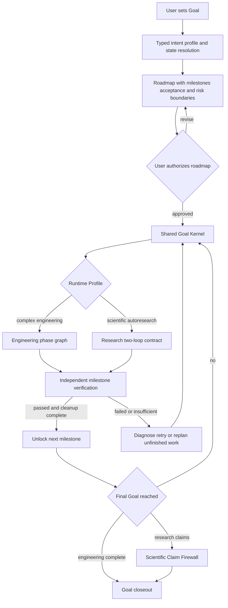
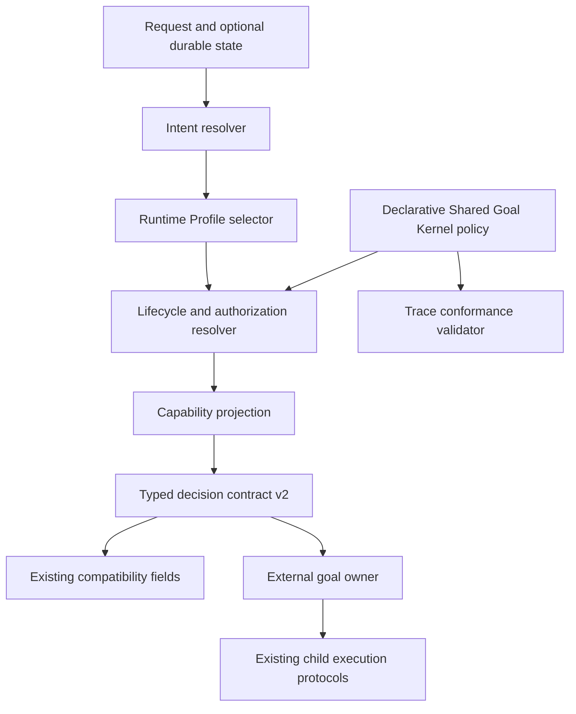
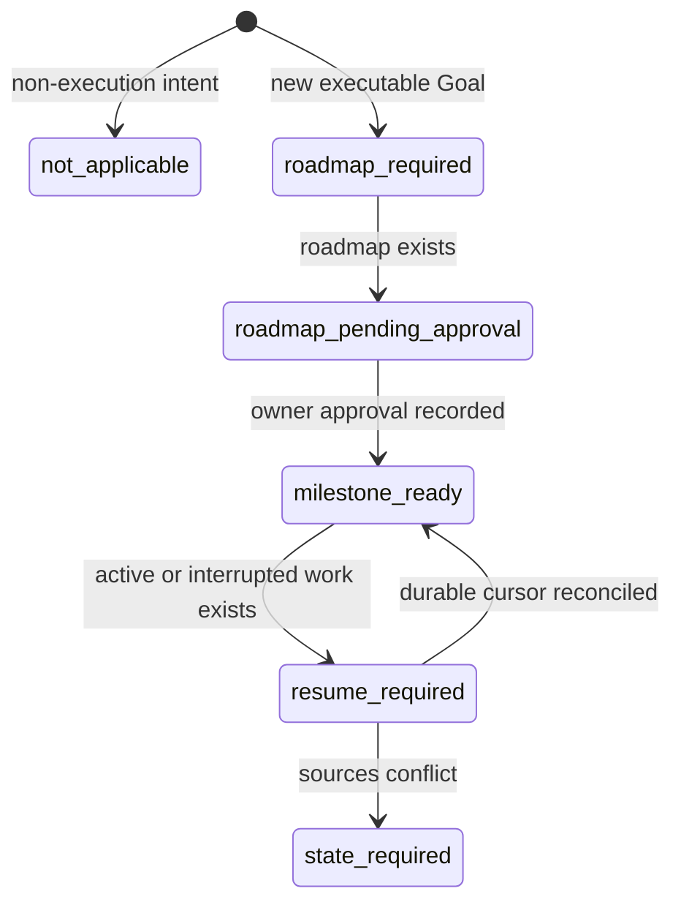
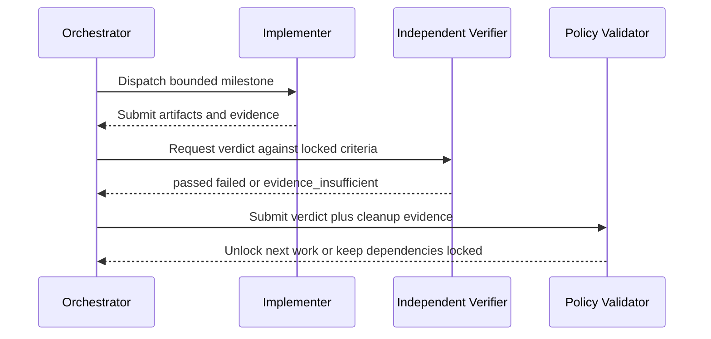

# Goal Runtime Profiles - Plan

## Goal Capsule

- **Objective:** Turn a confirmed Goal into an authorized milestone roadmap that remains aligned, independently verified, recoverable, and cleanly closed across complex-engineering and scientific-autoresearch work.
- **Product authority:** This Product Contract is the authority for scope, milestone progression, autonomy boundaries, verification, drift handling, subagent reclamation, and scientific claim integrity.
- **Open blockers:** None for product planning. Planning must preserve the confirmed boundaries while choosing concrete retry limits, timeout values, and state-source precedence.

---

## Product Contract

### Summary

Build one Shared Goal Kernel that governs an approved roadmap, gated milestones, independent verification, drift correction, resume, and subagent lifecycle.
Complex Engineering and Scientific Autoresearch use separate Runtime Profiles while reusing existing child skills and backend execution owners.

### Problem Frame

The current entry contract classifies requests at startup but does not govern whether later execution still serves the original Goal.
Long-running work can drift, milestone evidence can be self-accepted, and subagents can remain active or unreconciled after their useful work ends.

The current resolver can also collapse scientific execution or recovery language into report-only behavior.
The installed environment already contains engineering, research, resume, team, trace, and claim-verification capabilities, but they are not connected through one durable Goal progression contract.

### Key Decisions

- **Shared Kernel with two profiles.** Goal fidelity, authorization, milestones, verification, recovery, and cleanup are common; engineering and research progression remain domain-specific.
- **Roadmap before autonomy.** The user approves the initial milestones, acceptance criteria, dependencies, and risk boundaries once; autonomous execution then stays inside that envelope.
- **Milestones are gated.** A later milestone cannot begin until the current milestone passes independent verification and required cleanup.
- **Implementation and acceptance are separate.** An implementer submits evidence but cannot accept its own milestone.
- **Correction before escalation.** Drift pauses only affected work and attempts bounded correction; changes to Goal or locked acceptance criteria require renewed user approval.
- **Research claims are evidence-gated.** Integrity failure or insufficient evidence blocks new or stronger scientific claims.

### Actors

- A1. **Goal Owner:** Defines the Goal, approves the initial roadmap, and authorizes any later change to the Goal, acceptance criteria, or risk boundary.
- A2. **Main Orchestrator:** Maintains the roadmap, routes milestones, reconciles drift, controls Goal lifecycle, and owns final synthesis and closeout.
- A3. **Milestone Implementer:** Executes one bounded work unit and submits artifacts, evidence, risks, and terminal status without self-accepting the result.
- A4. **Independent Verifier:** Did not implement the milestone and returns a normalized acceptance verdict against the locked criteria.
- A5. **Runtime Profile:** Supplies domain progression and evidence expectations without becoming an independent scheduler.

### Requirements

**Goal control and authorization**

- R1. The original Goal remains the highest execution authority until the Goal Owner explicitly changes it.
- R2. Goal creation produces an initial roadmap containing milestones, dependencies, acceptance criteria, and risk boundaries before execution begins.
- R3. The Goal Owner must approve the initial roadmap before autonomous execution starts.
- R4. Roadmap approval authorizes autonomous progress only within the confirmed Goal, acceptance criteria, and risk boundaries.
- R5. Any proposed change to the Goal, an accepted milestone result, locked acceptance criteria, or risk boundaries requires renewed Goal Owner approval.
- R6. The system must preserve the original Goal and approved roadmap as comparison points throughout execution.
- R7. The system must expose which intent, Runtime Profile, lifecycle state, and authorization boundary govern the current run.

**Milestone progression and verification**

- R8. Each milestone has one bounded outcome and acceptance criteria that are fixed before its implementation begins.
- R9. A milestone remains locked from downstream progress until its prerequisites and predecessor milestones are accepted.
- R10. The Milestone Implementer submits artifacts and evidence but cannot issue the acceptance verdict.
- R11. The Independent Verifier returns `passed`, `failed`, or `evidence_insufficient` against the locked acceptance criteria.
- R12. A milestone is accepted only when the verdict is `passed` and all required subagent cleanup is complete.
- R13. A passed milestone unlocks only the next roadmap work whose dependencies are satisfied.
- R14. A failed or evidence-insufficient milestone keeps dependent work locked.
- R15. Failure evidence remains visible through retries and replanning and cannot be relabeled as success.

**Failure, drift, and recovery**

- R16. A milestone failure first triggers diagnosis and a bounded number of corrective retries without changing its acceptance criteria.
- R17. Exhausted retries trigger replanning of only the unfinished roadmap.
- R18. Replanning may change tactics and unfinished milestone structure but must preserve the authorized Goal, accepted results, acceptance criteria, and risk boundaries.
- R19. Detected Goal drift pauses the affected branch before further mutation or resource use.
- R20. Unaffected branches may continue only when their dependencies, write scopes, and evidence remain independent from the drifted branch.
- R21. Drift correction reconciles work against the original Goal, approved roadmap, and most recent accepted milestone.
- R22. A recoverable drift resumes automatically after alignment is restored; an unrecoverable boundary conflict requests Goal Owner direction.
- R23. Resume uses durable Goal, roadmap, milestone, work, cleanup, and research evidence rather than conversational memory alone.
- R24. Missing or conflicting resume evidence produces a visible state-required decision instead of silently routing to report-only or starting fresh.

**Subagent lifecycle and reclamation**

- R25. Every subagent has one bounded responsibility, explicit lifecycle state, and a terminal condition tied to its milestone.
- R26. Completion, failure, replacement, duplicate ownership, scope drift, prolonged blocking, and heartbeat timeout trigger reclamation review.
- R27. Reclamation stops or closes the subagent, releases its runtime resources, and records the outcome as cleanup evidence.
- R28. A subagent that has become stale, duplicate, out of scope, or unverifiable cannot remain active merely because its milestone is unfinished.
- R29. Subagents cannot create, update, bind, or close Codex Goals.
- R30. Milestone and Goal acceptance require zero unresolved subagents or an explicit terminal record explaining why no closeable handle exists.

**Shared Kernel and Runtime Profiles**

- R31. The Shared Goal Kernel owns roadmap authorization, milestone gates, independent verification, drift control, resume, lifecycle reconciliation, and shared closeout rules.
- R32. Runtime Profiles own domain progression and evidence expectations but do not replace the Shared Goal Kernel or existing execution owners.
- R33. The Complex Engineering Profile covers context, architecture boundaries, implementation, integration, validation, delivery, and closeout.
- R34. Engineering work units must be integration-ready before dispatch, including ownership, dependencies, output expectations, acceptance mapping, conflict handling, and fallback.
- R35. The Scientific Autoresearch Profile covers research bootstrap, inner experiment loops, outer synthesis loops, direction decisions, final evidence review, and writing handoff.
- R36. Research milestones distinguish confirmatory protocols from exploratory findings and preserve both positive and negative results.
- R37. Research direction changes use explicit `deepen`, `broaden`, `pivot`, or `conclude` decisions backed by accumulated evidence.
- R38. Both profiles reuse existing child skills and backend capabilities instead of duplicating their execution protocols in `goal-entry`.

**Scientific Claim Firewall**

- R39. Experiment-integrity failure blocks new or stronger claims based on the affected evidence.
- R40. An `evidence_insufficient` verdict blocks claim promotion and routes the roadmap toward supplementary evidence, narrowing, or pivot.
- R41. Warning or partial-support states permit only narrowed claims with explicit qualifiers and limitations.
- R42. Supported claims remain traceable to protocols, experiment artifacts, integrity status, verifier verdicts, and known limitations.
- R43. Replanning, synthesis, and paper writing cannot erase failed evidence or convert it into accepted support.

**Conformance and portability**

- R44. The conformance suite covers realistic Chinese and English requests for engineering execution, research bootstrap, experiment iteration, paper-to-code work, resume, no-execution, failure recovery, and closeout.
- R45. Routing invariants preserve intent when equivalent requests are translated or rephrased and keep explicit no-execution wording as a hard veto.
- R46. Adding analysis language to an execution request cannot silently downgrade it to report-only.
- R47. Standalone and full-stack environments produce compatible intent, profile, and lifecycle decisions while reporting provider differences explicitly.
- R48. Missing child capabilities produce a visible degradation or handoff result rather than a false full-execution claim.
- R49. Documentation, declared compatibility, and live installed capability are checked for drift.
- R50. Release acceptance requires both the complex-engineering and scientific-autoresearch end-to-end scenarios to pass.

### Key Flows

- F1. **New Goal authorization**
  - **Trigger:** The Goal Owner submits an executable long-running Goal.
  - **Actors:** A1, A2, A5
  - **Steps:** Resolve intent/profile/state; create the roadmap and milestone criteria; present dependencies and risk boundaries; wait for one roadmap approval.
  - **Outcome:** An authorized roadmap exists before execution.
  - **Covered by:** R1-R7.

- F2. **Milestone execution and acceptance**
  - **Trigger:** A milestone becomes dependency-ready.
  - **Actors:** A2, A3, A4
  - **Steps:** Dispatch bounded work; collect artifacts and evidence; reclaim terminal subagents; obtain the independent verdict.
  - **Outcome:** `passed` unlocks eligible work; other verdicts keep dependents locked.
  - **Covered by:** R8-R15, R25-R30.

- F3. **Failed milestone recovery**
  - **Trigger:** Verification returns `failed` or `evidence_insufficient`.
  - **Actors:** A2, A3, A4
  - **Steps:** Diagnose; perform bounded correction; reverify; replan unfinished work if retries are exhausted; request approval only for boundary changes.
  - **Outcome:** Failure is corrected, replanned, or escalated without rewriting its evidence.
  - **Covered by:** R14-R18.

- F4. **Goal-drift correction**
  - **Trigger:** Work no longer maps to the Goal, roadmap, accepted milestone, or assigned scope.
  - **Actors:** A2, A3, A4
  - **Steps:** Pause the affected branch; preserve evidence; compare against the latest accepted checkpoint; correct and resume or escalate.
  - **Outcome:** Drift is contained without stopping independent valid work.
  - **Covered by:** R19-R24.

- F5. **Complex-engineering progression**
  - **Trigger:** The selected profile is Complex Engineering.
  - **Actors:** A2-A5
  - **Steps:** Advance through context, boundaries, implementation, integration, validation, delivery, and closeout using milestone gates.
  - **Outcome:** Cross-module work is integrated and accepted with no unresolved execution or cleanup state.
  - **Covered by:** R31-R34, R50.

- F6. **Scientific-autoresearch progression**
  - **Trigger:** The selected profile is Scientific Autoresearch.
  - **Actors:** A2-A5
  - **Steps:** Bootstrap research; lock protocols; iterate experiments; synthesize; choose direction; apply the Claim Firewall before writing claims.
  - **Outcome:** Research concludes, pivots, or continues with traceable evidence and bounded claims.
  - **Covered by:** R31-R43, R50.

### Acceptance Examples

- AE1. **Covers R2-R5.** Given a newly created Goal, when the roadmap has not been approved, then no implementation milestone may start.
- AE2. **Covers R11-R14.** Given an implementer reports completion, when the independent verdict is not `passed`, then dependent milestones remain locked.
- AE3. **Covers R16-R18.** Given bounded retries fail, when replanning preserves Goal and acceptance boundaries, then the unfinished roadmap may change without new approval.
- AE4. **Covers R19-R22.** Given one branch drifts while another is independent, when drift is detected, then only the affected branch pauses and the independent branch may continue.
- AE5. **Covers R23-R24.** Given a resume request with conflicting state sources, when no trustworthy cursor can be selected, then the system requests state resolution instead of starting fresh.
- AE6. **Covers R26-R30.** Given a subagent finishes or loses its heartbeat, when its lifecycle becomes terminal or stale, then reclamation evidence is required before milestone acceptance.
- AE7. **Covers R39-R43.** Given experiment integrity fails, when the writing phase begins, then the affected claim cannot be introduced or strengthened.
- AE8. **Covers R44-R48.** Given equivalent Chinese and English autoresearch execution prompts, when routing runs in standalone and full-stack environments, then their core intent/profile/state decisions agree and provider gaps remain visible.

### Success Criteria

- The complex-engineering reference scenario reaches Goal closeout through authorized, independently accepted milestones with no unresolved subagent or cleanup state.
- The scientific-autoresearch reference scenario reaches a traceable claim verdict, and unsupported claims are blocked from the writing output.
- No downstream milestone begins before predecessor acceptance and required cleanup.
- Every detected drift event records a pause, reconciliation basis, correction or escalation, and final disposition.
- Every milestone acceptance identifies its implementer, independent verifier, locked criteria, evidence, verdict, and cleanup status.
- Standalone/full-stack conformance exposes missing capabilities and compatibility drift without changing the core task interpretation.

### Scope Boundaries

**In scope**

- Shared Goal governance, roadmap authorization, milestone progression, independent acceptance, drift control, resume, subagent reclamation, and closeout.
- Complex Engineering and Scientific Autoresearch Runtime Profiles.
- Scientific claim-integrity behavior and dual-profile conformance acceptance.

**Deferred for later**

- Additional Runtime Profiles beyond complex engineering and scientific autoresearch.
- A dynamic capability marketplace or general plugin-composition platform.
- A dedicated visual dashboard for roadmap, milestones, agents, and research evidence.

**Outside this product's identity**

- Turning `goal-entry` into an execution engine or second scheduler.
- Allowing subagents to own Codex Goal lifecycle operations.
- Automatically changing the original Goal, locked acceptance criteria, or risk boundaries without Goal Owner approval.
- Allowing an implementer to accept its own milestone or paper writing to bypass scientific evidence verdicts.

### Dependencies and Assumptions

- The full-stack environment continues to provide child protocols for preflight, context, objective, dispatch, team selection, backend artifacts, trace, closeout, autoresearch, and claim verification.
- Standalone installations may lack execution providers but can still classify the request and return an honest degradation or handoff.
- Durable artifacts remain accessible across sessions so resume and independent verification do not depend on chat history.
- An independent verifier is available for every milestone; unavailability produces `evidence_insufficient` rather than self-acceptance.

### Outstanding Questions

**Deferred to Planning**

- Select bounded retry limits by profile and milestone risk.
- Define heartbeat, prolonged-blocking, and graceful-reclamation timing.
- Define precedence and conflict handling across Goal, roadmap, harness, worktree, and research state sources.
- Choose the stable representation and compatibility projection for typed intent, profile, lifecycle, authorization, and verdict outputs.

### Sources and Research

- `docs/ideation/2026-07-10-goal-entry-complex-engineering-autoresearch-ideation.html`
- `AGENTS.md`
- `SKILL.md`
- `README.md`
- `references/architecture.md`
- `scripts/resolve_goal_entry.py`
- `scripts/quick_validate.py`

---

## Planning Contract

**Product Contract preservation:** Product Contract unchanged. The implementation adds a portable decision and conformance layer while preserving the rule that external `goal-*` skills own execution.

### Key Technical Decisions

- KTD1. **Keep the public package router-only.** `goal-entry` classifies intent, selects a Runtime Profile, reports lifecycle and authorization state, and names the next external owner; it never schedules milestones, reclaims processes, accepts evidence, or mutates Goal state.
- KTD2. **Add an additive version-2 decision contract.** Existing top-level version-1 fields remain as the compatibility projection, while a nested typed contract carries `task_profile`, `lifecycle_state`, `authorization_state`, `provider_status`, `verifier_requirement`, and `next_owner` without breaking current consumers.
- KTD3. **Use deterministic profile selection.** Explicit scientific execution, experiment iteration, evidence synthesis, and paper-to-code research signals select `scientific_autoresearch`; other executable long-running work selects `complex_engineering`; non-execution requests select no Runtime Profile.
- KTD4. **Resolve lifecycle from durable state input, not chat inference.** An optional runtime-state document supplies Goal, roadmap, accepted-milestone, active-work, cleanup, and research evidence; contradictory authoritative records return `state_required` and block a false resume.
- KTD5. **Publish a declarative Shared Goal Kernel policy.** A portable JSON contract defines milestone gates, verifier separation, drift disposition, reclamation triggers, claim-firewall outcomes, source precedence, and profile-specific defaults; external providers enforce it.
- KTD6. **Use bounded policy defaults.** Engineering milestones allow two corrective retries and research milestones one; heartbeat timeout is 120 seconds, prolonged blocking is 900 seconds, and graceful reclamation is 30 seconds unless the approved roadmap defines stricter in-boundary values.
- KTD7. **Represent provider gaps orthogonally.** A capability manifest identifies available child owners; missing required capabilities preserve the core intent/profile/lifecycle result but set provider status to `degraded` and authorization to `handoff_required` instead of inventing a lifecycle state or claiming full autonomous execution.
- KTD8. **Verify the kernel through deterministic trace replay.** A stdlib-only conformance validator replays engineering and autoresearch event traces and checks authorization, milestone locks, verifier independence, cleanup, drift recovery, and claim promotion without becoming a production scheduler.

### High-Level Technical Design

The router produces a portable decision and delegates all mutations to external owners.

Lifecycle values describe the handoff boundary rather than pretending the router executed it.

Provider availability is a separate status axis: `standalone`, `full_stack`, `degraded`, or `incompatible`. It can change the authorization handoff without rewriting the lifecycle cursor.

The conformance model admits milestone progress only after independent acceptance and cleanup.

### Assumptions and Constraints

- The standalone package can validate decisions and traces but cannot prove that an undeclared external child provider performed real mutations.
- Full-stack capability names are stable identifiers, while concrete installed paths and provider implementations remain outside this repository.
- Runtime-state and capability inputs are untrusted JSON and fail closed on malformed values, unknown states, or contradictory authority records.
- Original Goal, approved roadmap, and accepted milestone evidence outrank active-work, worktree, and conversation evidence in that order.
- The initial implementation uses Python standard library only and remains compatible with the repository's current Python 3 CLI style.

### Sequencing

Implement the declarative contract first, then make the resolver consume it, then add trace replay and conformance fixtures, and finally update public documentation. This keeps every later unit grounded in one stable vocabulary and prevents documentation or tests from inventing parallel semantics.

### System-Wide Impact

- Existing resolver consumers retain current fields and behavior while gaining an opt-in typed contract.
- Full-stack owners receive explicit next-owner and capability requirements instead of reverse-engineering router reasons.
- Goal resume becomes fail-closed when durable authority sources conflict.
- Research writing and claim promotion gain a portable blocking verdict that can be checked independently of the paper-writing surface.

### Risks and Mitigations

- **Contract drift between standalone and installed stacks:** validate declared capability names and profile policy markers in `quick_validate.py`, and make unknown capabilities visible rather than silently ignored.
- **Pattern-based profile misclassification:** preserve explicit no-execution precedence, add bilingual equivalent fixtures, and expose matched rules for diagnosis.
- **Reference validator mistaken for an executor:** document that trace replay proves conformance only and forbid mutation, process control, and Goal-tool calls in the validator.
- **Stale resume evidence:** reject conflicting authoritative records and require a state-resolution handoff instead of choosing the newest conversational claim.
- **Self-verification leakage:** require distinct implementer and verifier identities in accepted milestone trace events.

---

## Implementation Units

### U1. Define the portable Shared Goal Kernel and Runtime Profile contract

- **Goal:** Add one declarative source for profile stages, lifecycle vocabulary, authorization gates, verifier separation, retry/reclamation defaults, claim-firewall outcomes, capability ownership, and state-source precedence.
- **Requirements:** R1-R7, R16-R18, R23-R24, R31-R43, R47-R49; F1, F3-F6.
- **Dependencies:** None.
- **Files:** `references/runtime_profiles.json`, `references/architecture.md`, `tests/test_runtime_contract.py`.
- **Approach:** Keep the contract data-only and provider-agnostic. Name external owners but do not embed their execution procedures. Validate allowed identifiers, ownership boundaries, timing bounds, and profile-specific evidence gates.
- **Patterns to follow:** Existing responsibility split in `references/architecture.md` and stdlib validation style in `scripts/quick_validate.py`.
- **Test scenarios:**
  - Load the contract and verify both Runtime Profiles inherit the Shared Goal Kernel while declaring distinct stages and evidence expectations.
  - Verify retry, heartbeat, blocked, and reclamation defaults are positive bounded values and profile overrides cannot exceed the published boundary.
  - Verify the Scientific Claim Firewall blocks integrity failure and insufficient evidence, and narrows warning/partial outcomes.
  - Verify every mutation capability belongs to an external owner and no capability assigns Goal lifecycle authority to a subagent.
- **Verification:** The contract parses deterministically, all referenced states and owners are declared, and boundary violations fail with actionable validation errors.

### U2. Emit typed intent, profile, lifecycle, and authorization decisions

- **Goal:** Extend the resolver with deterministic Runtime Profile selection and an additive typed decision contract while preserving existing output fields.
- **Requirements:** R1, R6-R7, R19-R24, R31-R38, R44-R48; F1, F4-F6; AE4, AE5, AE8.
- **Dependencies:** U1.
- **Files:** `scripts/resolve_goal_entry.py`, `tests/test_resolve_goal_entry.py`, `tests/fixtures/routing_cases.json`.
- **Approach:** Add optional durable runtime-state input, derive lifecycle and authorization without mutating state, and project version-2 typed fields alongside unchanged compatibility keys. Explicit no-execution remains the highest routing veto.
- **Execution note:** Add characterization coverage for existing version-1 fields before extending the resolver.
- **Patterns to follow:** Frozen rule definitions, pure resolver helpers, sorted JSON CLI output, and visible `matched_rules` diagnostics.
- **Test scenarios:**
  - Covers AE8. Equivalent Chinese and English engineering requests select the same executable intent, Complex Engineering Profile, and new-Goal lifecycle.
  - Covers AE8. Equivalent Chinese and English autoresearch requests select Scientific Autoresearch even when they include analysis language.
  - Covers AE5. Conflicting Goal, roadmap, and milestone authority records return `state_required` without `create_goal` or active-goal binding.
  - An explicit no-execution request containing research and implementation terms remains non-execution with no Runtime Profile.
  - Existing consumers receive unchanged `request_mode`, tier, dispatch, goal-action, readiness, and reason fields for legacy fixtures.
  - Malformed runtime-state JSON and unknown lifecycle values fail closed with a CLI error rather than falling back to a fresh Goal.
- **Verification:** Legacy fixture outputs remain compatible and every executable decision exposes profile, lifecycle, authorization, and next-owner fields.

### U3. Add capability-aware degradation and external-owner handoff

- **Goal:** Make standalone and full-stack provider differences explicit without changing the task interpretation.
- **Requirements:** R7, R23-R24, R31-R32, R44-R49; F1, F4-F6; AE5, AE8.
- **Dependencies:** U1, U2.
- **Files:** `scripts/resolve_goal_entry.py`, `tests/test_resolve_goal_entry.py`, `tests/fixtures/capability_cases.json`.
- **Approach:** Accept an optional capability manifest, compare required profile/lifecycle capabilities with declared providers, and return available, missing, and next-owner information on a status axis separate from lifecycle. Keep compatibility `goal_action` stable unless durable state itself blocks authorization.
- **Test scenarios:**
  - A standalone engineering request preserves Complex Engineering classification and lifecycle, then reports missing roadmap, verification, and reclamation providers with `provider_status=degraded` and `authorization_state=handoff_required`.
  - A declared full-stack engineering capability set reports ready handoff with `goal-preflight` as the next owner.
  - A research capability set missing claim verification blocks claim-promotion handoff while preserving Scientific Autoresearch classification.
  - Unknown capability names are reported as compatibility drift and cannot satisfy a required capability.
  - Capability availability never allows a subagent identity to become Goal owner or independent verifier for its own milestone.
- **Verification:** Provider status distinguishes standalone, full-stack, degraded, and incompatible declarations with stable machine-readable fields.

### U4. Implement deterministic milestone and claim conformance replay

- **Goal:** Prove the Shared Goal Kernel rules across complete engineering and autoresearch scenarios without adding a scheduler.
- **Requirements:** R8-R30, R34-R43, R44-R50; F2-F6; AE1-AE8.
- **Dependencies:** U1.
- **Files:** `scripts/validate_goal_runtime.py`, `tests/test_goal_runtime_replay.py`, `tests/fixtures/engineering_runtime_trace.json`, `tests/fixtures/autoresearch_runtime_trace.json`, `tests/fixtures/invalid_runtime_traces.json`.
- **Approach:** Replay immutable trace events through a pure validation state machine. Validate roadmap approval, dependency locks, retry and replan boundaries, drift pause/correction, verifier independence, reclamation evidence, resume cursor authority, and Claim Firewall outcomes. The tool reports violations but performs no mutations or process control.
- **Test scenarios:**
  - Covers AE1. Reject milestone start before roadmap approval.
  - Covers AE2. Reject downstream unlock after implementer completion without an independent `passed` verdict and cleanup evidence.
  - Covers AE3. Accept bounded correction and unfinished-roadmap replan while rejecting changes to accepted results or locked criteria.
  - Covers AE4. Pause only a drifted independent branch and reject continued mutation on that branch until reconciliation.
  - Covers AE6. Reject milestone acceptance when terminal, stale, duplicate, or replaced subagent records lack cleanup disposition.
  - Covers AE7. Reject new or stronger claims after integrity failure or insufficient evidence; accept only qualified narrowing for warning/partial support.
  - Accept the full engineering trace through closeout with zero unresolved subagents.
  - Accept the full autoresearch trace through evidence-backed claim disposition and writing handoff.
- **Verification:** Both valid end-to-end traces pass; each invalid trace fails for its intended invariant with no false full-execution claim.

### U5. Integrate package validation and public guidance

- **Goal:** Make the typed contract, Runtime Profiles, provider boundary, conformance commands, and recovery semantics discoverable and release-checked.
- **Requirements:** R6-R7, R23-R24, R29-R32, R38, R44-R50; F1-F6.
- **Dependencies:** U1-U4.
- **Files:** `SKILL.md`, `README.md`, `references/architecture.md`, `scripts/quick_validate.py`, `agents/openai.yaml`.
- **Approach:** Update the routing contract and Chinese-first examples, add contract/fixture validation to the existing package gate, and explain that external child skills enforce roadmap and lifecycle actions.
- **Test scenarios:**
  - Package validation fails when required profile files, contract markers, E2E traces, or external-owner boundaries are missing.
  - Documented engineering and research examples produce the shown profile, lifecycle, provider, and goal-action decisions.
  - Documentation contains no local absolute paths, secret material, or wording that claims the standalone validator executes milestones.
  - The required resolver smoke command remains successful and backward compatible.
- **Verification:** A fresh standalone checkout can run the documented checks with Python 3 only and receives honest provider-gap output.

---

## Verification Contract

| Gate | Command | Covers | Done signal |
|---|---|---|---|
| Unit tests | `python3 -m unittest discover -s tests -v` | U1-U4 | Contract, resolver, capability, and trace tests pass. |
| Package validation | `python3 scripts/quick_validate.py .` | U1-U5 | Required files, markers, fixtures, and E2E scenarios pass. |
| Legacy resolver smoke | `python3 scripts/resolve_goal_entry.py --request 'PLEASE IMPLEMENT THIS PLAN with tests' --readiness-status passed` | U2, U3, U5 | Existing fields retain compatible values and typed fields are present. |
| Engineering profile smoke | `python3 scripts/resolve_goal_entry.py --request '请实现这个跨模块工程并按里程碑验收' --readiness-status passed` | U2, U3 | Complex Engineering, roadmap-required lifecycle, and provider status are explicit. |
| Research profile smoke | `python3 scripts/resolve_goal_entry.py --request '启动自动科研，迭代实验并根据证据决定论文结论' --readiness-status passed` | U2, U3 | Scientific Autoresearch and Claim Firewall capability requirements are explicit. |
| Runtime replay | `python3 scripts/validate_goal_runtime.py tests/fixtures/engineering_runtime_trace.json tests/fixtures/autoresearch_runtime_trace.json` | U4 | Both profile traces reach valid terminal states. |
| Diff hygiene | `git diff --check` | U1-U5 | No whitespace errors or accidental conflict markers. |

Release acceptance requires the unit suite, package gate, both profile smokes, both E2E trace replays, and diff hygiene to pass in one checkout.

These gates prove the standalone decision and conformance contract. They do not claim that an undeclared external child provider performed real Goal mutations; each full-stack provider remains responsible for its own integration evidence.

---

## Definition of Done

- The version-2 typed decision contract is additive and legacy resolver fixtures retain their prior semantic outputs.
- Every executable request reports a Runtime Profile, lifecycle state, authorization state, provider status, and next external owner.
- New Goal, approved roadmap, milestone progression, failed verification, drift correction, resume conflict, reclamation, and closeout invariants are represented in the portable contract and enforced by trace validation.
- Implementer and verifier identities must differ before milestone acceptance can pass.
- Terminal or stale subagents require cleanup disposition before milestone or Goal acceptance can pass.
- Scientific claim promotion is blocked for integrity failure and insufficient evidence, and warning/partial evidence permits only qualified narrowing.
- Standalone and declared full-stack scenarios preserve core intent/profile/lifecycle decisions while exposing provider differences.
- Release evidence distinguishes standalone conformance from external provider integration and never treats a declared capability as proof that a real mutation occurred.
- Both Complex Engineering and Scientific Autoresearch E2E traces pass, and intentionally invalid traces fail for the expected invariant.
- `goal-entry` remains router-only; no production code schedules milestones, controls processes, mutates Goal state, or duplicates external child protocol steps.
- Public docs remain portable, Chinese-first, and free of local paths, credentials, or false execution claims.
- All abandoned implementation experiments, generated bytecode, and temporary artifacts are removed before commit.
- The focused commit, pushed branch, PR checks, and CI are green before the LFG delivery is complete.
