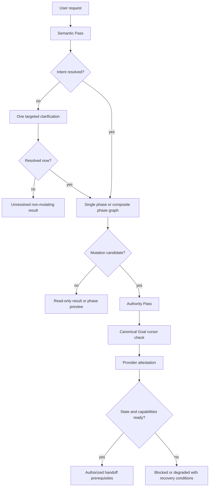
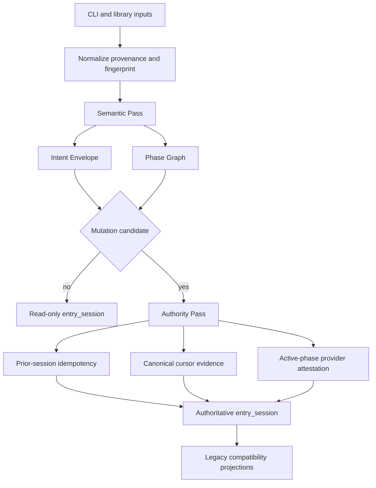

# Goal Entry Session Protocol - Plan

## Goal Capsule

- **Objective:** Turn every user request into a duplicate-safe, explainable Entry Session that can abstain, compile composite work, bind authoritative Goal state, and prove provider readiness before any mutation.
- **Product authority:** This Product Contract governs the public `goal-entry` interpretation, phase-compilation, durable-binding, and capability-attestation behavior while preserving the approved Shared Goal Kernel and Runtime Profile contract.
- **Open blockers:** None. Implementation-time discoveries may refine internal representations but cannot weaken the mutation gates or owner boundaries.
- **Execution profile:** Implement in five dependency-ordered units, beginning with contract fixtures and characterization tests before resolver behavior changes.
- **Stop conditions:** Stop if compatibility requires contradictory legacy and authoritative decisions, or if canonical state/provider evidence would have to be fabricated inside the standalone package.
- **Tail ownership:** The implementing agent owns validation and documentation; the main orchestrator owns review fixes, commit, PR, and CI closeout.

---

## Product Contract

### Summary

Build one risk-adaptive Two-Pass Entry Session.
The Semantic Pass interprets intent and compiles phase semantics; the Authority Pass runs only for mutation candidates and verifies durable Goal identity plus provider readiness.

### Problem Frame

The v0.1.0 resolver can classify requests, select one Runtime Profile, validate caller-provided state, and compare declared capability names.
It cannot represent uncertainty, preserve instruction provenance, compile profile changes inside one Goal, detect stale revisions or duplicate entry calls, or prove that a named provider is currently usable.

These gaps are most dangerous at the public entry boundary.
A wrong decision can create or bind the wrong Goal and then feed a well-controlled milestone runtime with the wrong authority.

### Key Decisions

- **Risk-adaptive activation.** The Intent Envelope always runs; composite compilation, durable cursor binding, and provider attestation activate only when the request needs them.
- **Two-pass separation.** The Semantic Pass produces an immutable interpretation consumed by the Authority Pass, which cannot reinterpret the request.
- **Fail closed for mutation.** Ambiguous execution intent blocks Goal mutation while read-only analysis remains available.
- **One Goal with phase-level profiles.** Composite work uses one ordered phase graph instead of one lifetime profile or multiple nested Goals.
- **Roadmap approval is the transition envelope.** Approved phase transitions proceed without repeated confirmation unless a locked boundary materially changes.
- **Canonical state only.** Caller state and conversation context can discover candidate Goals but cannot authorize mutation.
- **Idempotency covers the Entry Session.** Duplicate protection applies to interpretation, compilation, binding, and provider negotiation, not only Goal creation.
- **Provider readiness is not Goal authorization.** Attestation proves current capability availability; preflight and approved Goal policy still govern execution.
- **Planning may proceed while execution is degraded.** Missing provider capabilities block the affected phase, not Goal creation or roadmap approval.

### Actors

- A1. **Goal Owner:** Supplies the request, resolves ambiguity, selects among multiple Goal candidates, and approves the roadmap or material boundary changes.
- A2. **Entry Client:** Supplies request provenance, stable idempotency identity, conversation correlation, and available discovery hints.
- A3. **Semantic Pass:** Produces the Intent Envelope and optional phase graph without owning durable state or execution.
- A4. **Canonical Goal State Owner:** Issues authoritative cursors and revisions and resolves durable Goal conflicts.
- A5. **Capability Provider:** Attests its identity, version, capabilities, health, and validity window.
- A6. **Main Orchestrator:** Consumes the completed Entry Session, runs existing preflight, and hands authorized work to external `goal-*` owners.

### Requirements

**Entry Session identity and activation**

- R1. Every invocation produces one versioned Entry Session identity bound to a normalized request fingerprint.
- R2. The Semantic Pass runs for every request, while the Authority Pass runs only when the resolved request could create, bind, resume, or mutate a Goal.
- R3. Both passes must use the same Entry Session identity, fingerprint, and contract version.
- R4. The Authority Pass must consume the locked Semantic Pass result without reclassifying the user's intent or phase structure.
- R5. Simple report, explanation, and read-only analysis requests must complete without durable-state lookup or provider attestation.

**Intent Envelope and ambiguity**

- R6. The Semantic Pass must distinguish the user's instruction from quoted material, attachments, prior assistant text, and other non-authoritative content.
- R7. The Intent Envelope must expose the selected interpretation, plausible alternatives, matched evidence, and whether mutation is permitted.
- R8. Explicit no-execution language is a hard veto against Goal creation, binding, resume, and provider activation.
- R9. Ambiguous execution intent must block mutation and trigger at most one targeted clarification question.
- R10. If one clarification does not resolve the ambiguity, the Entry Session must end as `unresolved_non_mutating` with candidate interpretations and a resume handle.
- R11. Correcting an interpretation or changing no-execution intent to execution must create a new fingerprinted Entry Session rather than mutate the prior session's authority.
- R12. Read-only analysis may continue when execution intent is ambiguous if the result cannot be mistaken for an authorized Goal action.

**Composite Goal compilation**

- R13. A composite request must compile into one ordered phase graph under one Goal.
- R14. Each phase must identify its Runtime Profile, intended outcome, expected artifacts, dependencies, and entry and exit conditions.
- R15. A non-composite request must use the same contract with one phase rather than a separate routing model.
- R16. A no-execution request may receive a non-authoritative phase-graph preview that creates no Goal, cursor, or provider session.
- R17. Initial roadmap approval must authorize the phase order and declared profile transitions represented in the approved roadmap.
- R18. A change to the Goal, accepted evidence, locked acceptance criteria, risk boundary, phase order, or approved provider behavior, cost, or permission boundary must pause affected work and require renewed approval.
- R19. Phase compilation must remain an intent artifact; `goal-plan` retains roadmap, milestone, and scheduling ownership.

**Durable Goal Cursor**

- R20. Only a cursor issued by the canonical Goal state owner may authorize Goal binding, resume, or mutation.
- R21. Caller-provided state and conversation context may discover candidates but cannot override the canonical cursor.
- R22. A cursor must bind the Goal namespace, authoritative revision, state source, and relevant conversation or thread correlation.
- R23. Mutation must fail closed when the expected revision does not match the canonical revision.
- R24. Exact retries with the same idempotency key and request fingerprint must return the prior completed result or the same in-progress Entry Session.
- R25. Reusing an idempotency key with a different request fingerprint must return a conflict without Goal mutation.
- R26. One exact thread or correlation match may bind automatically when no competing candidate exists.
- R27. Multiple viable active Goals must block mutation until the Goal Owner selects from a compact candidate list.
- R28. Candidate recency may control list order but must not authorize automatic Goal selection.

**Capability Attestation Session**

- R29. The Authority Pass must negotiate provider identity, compatible contract version, required capabilities, current health, and validity before phase execution.
- R30. Declared capability names without provider attestation must not produce a full-readiness claim.
- R31. Capability requirements must be evaluated for the phase about to execute rather than for every possible phase at initial entry.
- R32. Missing, expired, unhealthy, or incompatible capabilities must identify the blocked phase, missing requirements, provider status, and recovery conditions.
- R33. Provider failure must not prevent Goal creation, phase compilation, or roadmap approval when those actions do not require the missing capability.
- R34. A phase must not start until its required capabilities have valid attestations and existing Goal authorization gates pass.
- R35. If attestation becomes invalid during execution, the runtime must stop scheduling new mutations and let the current atomic operation reach a safe checkpoint.
- R36. A paused phase may resume automatically after renegotiation only when provider behavior remains compatible with the approved phase contract.
- R37. Failed or incompatible renegotiation must preserve accepted evidence and durable cursor state while leaving the phase paused for resolution.

**Compatibility and evidence boundary**

- R38. Legacy decision fields may remain as compatibility projections but must not contradict the Entry Session's authoritative result.
- R39. The standalone package must compute and validate Entry Session semantics without claiming ownership of canonical state, provider execution, roadmap scheduling, or Goal mutation.
- R40. A passing contract replay or capability attestation must not be presented as evidence that an external owner completed a real mutation.
- R41. Replaying a completed Entry Session must not extend the validity of an expired cursor, attestation, or execution authorization.

### Key Flows

- F1. **Read-only request**
  - **Trigger:** The Goal Owner asks for explanation, analysis, or a no-execution composite preview.
  - **Actors:** A1, A2, A3.
  - **Steps:** The Semantic Pass resolves non-mutating intent and optionally compiles a preview; the Authority Pass does not run.
  - **Outcome:** A read-only result with no Goal, durable cursor, or provider session.

- F2. **Ambiguous execution request**
  - **Trigger:** More than one plausible interpretation could lead to mutation.
  - **Actors:** A1, A3.
  - **Steps:** Mutation pauses; the system asks one targeted clarification; a second ambiguity ends the session as unresolved.
  - **Outcome:** Either a locked Semantic Pass result or a resumable non-mutating result.

- F3. **New composite Goal**
  - **Trigger:** One request spans multiple domain phases and requests execution.
  - **Actors:** A1, A3, A4, A5, A6.
  - **Steps:** The Semantic Pass compiles one phase graph; the Authority Pass verifies Goal identity and capabilities needed for the first executable phase; the orchestrator performs existing preflight and roadmap handling.
  - **Outcome:** One Goal with phase-aware planning prerequisites and no nested Goal creation.

- F4. **Resume with durable state**
  - **Trigger:** The user asks to continue work associated with an existing Goal.
  - **Actors:** A1, A2, A4, A5, A6.
  - **Steps:** The state owner returns candidates; one exact match binds automatically or multiple candidates require selection; revision and provider readiness are then checked.
  - **Outcome:** Resume is authorized against one current cursor or remains blocked without mutation.

- F5. **Duplicate or conflicting entry call**
  - **Trigger:** An Entry Client retries a request or reuses an idempotency key.
  - **Actors:** A2, A3, A4.
  - **Steps:** The session compares key and fingerprint; exact retries reuse the existing result; mismatched reuse returns a conflict.
  - **Outcome:** No duplicate Goal, binding, compilation, or provider activation.

- F6. **Provider unavailable or invalidated**
  - **Trigger:** Required attestation is absent before a phase or becomes invalid during it.
  - **Actors:** A5, A6.
  - **Steps:** Planning-safe work may continue; new mutations stop; in-flight atomic work reaches a checkpoint; renegotiation either restores compatible readiness or pauses the phase.
  - **Outcome:** No execution under unproven capability and no loss of accepted evidence.

### Acceptance Examples

- AE1. **Covers R5, R8, R16.** Given a request to analyze a research-to-engineering task without execution, when the Semantic Pass compiles a phase preview, then no Goal, cursor, or provider session is created.
- AE2. **Covers R7, R9, R10.** Given two plausible mutation-bearing interpretations, when one clarification remains ambiguous, then the session ends as `unresolved_non_mutating` and exposes both candidates.
- AE3. **Covers R11.** Given a prior no-execution preview, when the user later requests execution, then a new fingerprinted Entry Session is created and the old preview gains no authority.
- AE4. **Covers R13-R19.** Given a request to research, implement, experiment, and write, when compilation succeeds, then one ordered Goal phase graph preserves the engineering and research profile boundaries.
- AE5. **Covers R20-R23.** Given a caller snapshot and a newer canonical cursor for the same Goal, when resume is requested, then the stale expected revision blocks mutation.
- AE6. **Covers R24-R25, R41.** Given a network retry with the same idempotency key, when the fingerprint matches, then the prior result is returned without extending its authority validity; when it differs, the session returns a conflict.
- AE7. **Covers R26-R28.** Given two viable active Goals, when neither is the sole exact correlation match, then recency only sorts the choices and the user must select one.
- AE8. **Covers R29-R34.** Given an approved roadmap and a missing capability for a later phase, when the Goal is created, then planning proceeds but that phase cannot start.
- AE9. **Covers R35-R37.** Given a provider health loss during a phase, when the current atomic operation reaches a checkpoint, then new mutations remain stopped until compatible renegotiation succeeds.
- AE10. **Covers R38-R40.** Given a valid standalone Entry Session with no external execution evidence, when results are reported, then compatibility fields remain consistent and no completed-mutation claim is emitted.

### Success Criteria

- Zero erroneous Goal mutation across the acceptance examples for ambiguity, retry, stale cursor, multiple Goals, and provider degradation.
- Deterministic replay produces the same Semantic Pass result for the same versioned input and request fingerprint.
- Simple read-only requests complete without activating cursor or provider checks.
- Composite engineering and scientific-autoresearch requests preserve phase-specific evidence and approval boundaries under one Goal.
- Standalone validation distinguishes contract conformance, provider readiness, and real external mutation evidence.
- Existing v0.1.0 Runtime Profile and trace-conformance journeys remain valid unless an explicit compatibility migration is approved.

### Scope Boundaries

**Deferred for later**

- Acknowledged handoff receipts and receiver timeouts from ideation direction B5.
- Human risk-budget, pause, cancel, and amend controls beyond the clarification and approval behavior defined here from B6.
- Production correction telemetry, shadow routing, and large-scale calibration infrastructure from B7.

**Outside this product's identity**

- Embedding a canonical Goal state store in the standalone `goal-entry` package.
- Running providers, scheduling milestones, executing phase work, or replacing external `goal-*` owners.
- Creating nested Goals for phase transitions.
- Treating a model-only classification or caller-declared capability list as mutation authority.

### Dependencies and Assumptions

- The approved Shared Goal Kernel and Runtime Profiles remain the authority for roadmap, milestone, verifier, reclamation, drift, and Claim Firewall behavior.
- A canonical Goal state owner can issue authoritative Goal identity and revision information.
- Capability providers can expose identity, version, health, capability, and validity evidence through an integration boundary.
- Entry clients can preserve a stable idempotency key across retries of the same intended request.
- External preflight and execution owners continue to enforce real mutation authorization after the Entry Session completes.

### Outstanding Questions

**Resolve Before Planning**

- None.

**Deferred to Implementation**

- Exact error text and internal helper naming may follow existing resolver conventions.
- Fixture volume may grow when implementation uncovers additional equivalence classes, but every acceptance example remains mandatory.

### Sources and Research

- `docs/ideation/2026-07-10-goal-entry-complex-engineering-autoresearch-ideation.html`
- `docs/plans/2026-07-11-001-feat-goal-runtime-profiles-plan.md`
- `scripts/resolve_goal_entry.py`
- `references/runtime_profiles.json`
- `references/architecture.md`
- `tests/fixtures/routing_cases.json`
- [Model Context Protocol lifecycle](https://modelcontextprotocol.io/specification/2025-06-18/basic/lifecycle)
- [OpenAI Agents SDK handoffs](https://openai.github.io/openai-agents-python/handoffs/)
- [IETF Idempotency-Key draft](https://datatracker.ietf.org/doc/html/draft-ietf-httpapi-idempotency-key-header)

---

## Planning Contract

### Key Technical Decisions

- **KTD1. Add one authoritative `entry_session` envelope.** Keep the top-level version-1 fields and current version-2 `decision_contract` as compatibility projections, while all new B1-B4 semantics live in a separately versioned additive envelope. The legacy `provider_status` remains declaration coverage rather than execution authority, so a legacy `full_stack` projection may coexist with an authoritative attestation block without implying readiness.
- **KTD2. Implement the Two-Pass model as pure deterministic functions.** The Semantic Pass receives normalized request provenance and returns an immutable semantic result. The Authority Pass receives that result plus external evidence and may only narrow execution authorization.
- **KTD3. Canonicalize fingerprints with standard-library SHA-256.** Hash a stable JSON representation of contract version, provenance-separated request parts, clarification input, and conversation correlation. Exclude wall-clock output fields so equivalent retries replay identically.
- **KTD4. Treat external verification as typed evidence, not local trust invention.** Canonical cursors and provider attestations include issuer, subject, revision or capability scope, upstream verification status, issued/expiry times, and an opaque proof reference bound to the Entry Session scope. The standalone resolver accepts evidence only through a contract-recognized trusted adapter, rejects caller-shaped lookalikes, validates policy consistency, and never claims that it performed cryptographic verification.
- **KTD5. Keep phase compilation declarative and profile-driven.** Split explicit ordered clauses, classify each phase with existing profile rules, collapse adjacent identical profiles, and derive default artifacts and transition expectations from the Runtime Profile contract. `goal-plan` remains responsible for milestone construction.
- **KTD6. Model idempotency as replay input.** Derive a stable session ID from contract version, idempotency key, and request fingerprint, then accept a prior Entry Session supplied by the external session owner. Exact matches return that result with replay metadata, in-progress matches retain the same identity, and mismatches fail closed.
- **KTD7. Evaluate provider evidence per active phase.** Legacy capability declarations remain visible for compatibility, but authoritative execution readiness requires a valid attestation covering the active phase's required capabilities.
- **KTD8. Reuse the trace validator for mid-phase invalidation policy.** Extend immutable trace conformance with attestation invalidation, safe checkpoint, renegotiation, compatible resume, and paused outcomes; do not introduce a scheduler or process controller.
- **KTD9. Release the additive protocol as v0.2.0.** The change adds a new public contract while retaining old invocations, so the package version advances from v0.1.0 to v0.2.0 and contract versions evolve independently.

### High-Level Technical Design

`references/entry_session_contract.json` becomes the portable policy source for Entry Session states, activation rules, trusted owner names, evidence fields, idempotency outcomes, and two-pass invariants.
It references the existing Runtime Profile names and capability ownership rather than duplicating their domain progression.

`scripts/resolve_goal_entry.py` loads both declarative contracts and builds one internal decision in two passes.
Legacy outputs and the new `entry_session` envelope are projections of that decision.
New CLI JSON inputs carry provenance, clarification, prior-session replay, canonical cursor candidates, and provider attestations while old invocations remain valid.

`scripts/validate_goal_runtime.py` remains an immutable event replay validator.
It gains provider-invalidation lifecycle events only to prove that no new mutation starts before a safe checkpoint and compatible renegotiation.

### Assumptions and Constraints

- Python standard library remains sufficient; no runtime dependency is introduced for JSON canonicalization, hashing, or time validation.
- Proof references are opaque external evidence. The package does not ship credentials, trust roots, or private keys.
- Legacy callers that provide only `--request`, readiness, runtime-state, and capability declarations continue receiving their existing top-level fields.
- New authoritative mutation readiness is available only when the corresponding evidence inputs satisfy the Entry Session contract.
- Public artifacts and examples remain bilingual-friendly and contain no machine-local paths or secrets.

### Sequencing

1. Lock the additive contract and failing/characterization fixtures before changing resolver output.
2. Implement the pure Semantic Pass and composite compiler.
3. Add Entry Session identity, replay, canonical cursor, and multi-Goal binding.
4. Add provider attestation and runtime trace invalidation behavior.
5. Close compatibility, documentation, validation, and release-facing evidence.

### System-Wide Impact

- **Public API:** The resolver gains additive inputs and output while preserving old command shapes.
- **State authority:** Canonical Goal state stays external; the package consumes verified cursor evidence instead of promoting caller snapshots.
- **Provider boundary:** Capability names remain a compatibility view, while execution readiness becomes phase-scoped and evidence-backed.
- **Testing:** Routing fixtures expand from single-profile examples to provenance, ambiguity, composite, replay, cursor, and attestation journeys.
- **Documentation:** README, skill contract, and architecture must distinguish semantic resolution, Goal authorization, provider readiness, and real execution evidence.

### Risks and Mitigations

- **Legacy projection drift:** Build all projections from one internal decision and add contradiction assertions.
- **False authority from opaque proof fields:** Require external `verification_status=verified`, recognized issuer/subject relationships, freshness, and exact Goal/provider scope; document that verification is performed upstream.
- **Replay extends stale authority:** Return the prior response for idempotency while recomputing whether its cursor and attestation validity window still permits any new mutation.
- **Misreading legacy `full_stack`:** Name it as declaration coverage in output documentation and assert that only the Authority Pass can set phase execution readiness.
- **Phase compiler overreach:** Compile only explicit ordered clauses and fall back to one phase when ordering is unclear; do not infer milestones.
- **Fingerprint instability:** Canonicalize JSON with sorted keys and fixed separators and exclude generated timestamps.
- **Test-only confidence:** Keep standalone conformance distinct from full-stack integration evidence in outputs and docs.

---

## Implementation Units

### U1. Define the additive Entry Session contract and characterization baseline

- **Goal:** Establish the portable policy model and lock current compatibility behavior before new resolver semantics land.
- **Requirements:** R1-R5, R38-R41.
- **Flows and acceptance:** F1, F5; AE10.
- **Files:** `references/entry_session_contract.json`, `tests/test_entry_session_contract.py`, `tests/test_resolve_goal_entry.py`, `tests/fixtures/entry_session_cases.json`.
- **Approach:** Declare session/pass states, activation rules, provenance lanes, evidence requirements, idempotency outcomes, and trusted external owner identifiers. Add characterization assertions for current version-1 and version-2 projections and failing assertions for the new envelope.
- **Patterns to follow:** `references/runtime_profiles.json`; declarative loading and invariant tests in `tests/test_runtime_contract.py`.
- **Test scenarios:** Contract has one Semantic Pass and one Authority Pass; every mutation-bearing terminal state requires resolved semantics; read-only terminals do not require Authority Pass; legacy projection categories remain enumerated; unknown contract states fail validation.
- **Verification:** Run `python3 -m unittest discover -s tests -p 'test_entry_session_contract.py' -v` followed by the resolver suite, and retain the expected red result for unimplemented envelope behavior before U2.
- **Dependencies:** None.

### U2. Implement the Semantic Pass and composite phase compiler

- **Goal:** Produce provenance-aware intent results, bounded ambiguity behavior, and single/composite phase semantics without performing authority checks.
- **Requirements:** R6-R19.
- **Flows and acceptance:** F1-F3; AE1-AE4.
- **Files:** `scripts/resolve_goal_entry.py`, `references/entry_session_contract.json`, `tests/test_resolve_goal_entry.py`, `tests/fixtures/entry_session_cases.json`, `tests/fixtures/composite_phase_cases.json`.
- **Approach:** Normalize authoritative instruction and non-authoritative context separately; calculate deterministic candidate matches; recognize explicit ambiguity and one clarification attempt; compile explicit ordered clauses into phase records and collapse adjacent equal profiles; return preview-only semantics under no-execution.
- **Patterns to follow:** Existing named `PatternRule` groups and bilingual routing fixtures; Runtime Profile stages and evidence expectations in `references/runtime_profiles.json`.
- **Test scenarios:** Quoted implementation text cannot override a read-only instruction; explicit no-execution produces a preview with no mutation candidate; explicit either/or execution ambiguity requests one clarification; a still-ambiguous clarification ends unresolved; research-to-engineering-to-research ordering produces three phases; unclear order falls back to one phase; adjacent same-profile clauses collapse.
- **Verification:** Run `python3 -m unittest tests.test_resolve_goal_entry -v` and inspect new fixture cases for deterministic English/Chinese parity.
- **Dependencies:** U1.

### U3. Add Entry Session replay and canonical Durable Goal Cursor handling

- **Goal:** Make creation/resume decisions duplicate-safe and bind mutations only to authoritative current Goal identity.
- **Requirements:** R1-R4, R20-R28, R41.
- **Flows and acceptance:** F4-F5; AE3, AE5-AE7.
- **Files:** `scripts/resolve_goal_entry.py`, `tests/test_resolve_goal_entry.py`, `tests/fixtures/idempotency_cases.json`, `tests/fixtures/cursor_cases.json`.
- **Approach:** Generate stable session identity and fingerprint; reconcile prior-session replay before Goal actions; validate cursor issuer, verification state, Goal namespace, revision, status, freshness, and correlation; distinguish exact single match, multiple candidates, stale revision, and absent authority.
- **Patterns to follow:** Current fail-closed runtime-state validation and `authority_goal_ids()` conflict behavior.
- **Test scenarios:** Exact completed retry returns the prior result without extending expired authority; exact in-progress retry retains its session; mismatched fingerprint conflicts; stale expected revision blocks mutation; one exact correlation match binds; two candidates require user selection; recency changes ordering only; caller runtime-state JSON and spoofed owner evidence cannot override a verified cursor.
- **Verification:** Run `python3 -m unittest tests.test_resolve_goal_entry -v` and confirm no duplicate `create_goal` action appears across replay fixtures.
- **Dependencies:** U1, U2.

### U4. Add phase-scoped Capability Attestation and invalidation conformance

- **Goal:** Prove current provider readiness for the active phase and pause safely when evidence expires or becomes incompatible.
- **Requirements:** R29-R37, R40.
- **Flows and acceptance:** F6; AE8-AE10.
- **Files:** `scripts/resolve_goal_entry.py`, `scripts/validate_goal_runtime.py`, `references/entry_session_contract.json`, `tests/test_resolve_goal_entry.py`, `tests/test_goal_runtime_replay.py`, `tests/fixtures/attestation_cases.json`, `tests/fixtures/invalid_runtime_traces.json`.
- **Approach:** Validate provider identity, version compatibility, health, issued/expiry times, proof reference, and active-phase capability coverage; distinguish planning readiness from execution readiness; extend trace replay with invalidated, checkpointed, renegotiated, resumed, and paused events.
- **Patterns to follow:** Current provider availability sets in `resolve_provider()` and immutable event invariant checks in `validate_goal_runtime.py`.
- **Test scenarios:** Declarations without attestation never authorize phase execution; spoofed issuer or mismatched session scope is rejected; missing later-phase capability does not block Goal creation; expired or unhealthy attestation blocks the phase with recovery details; mid-phase invalidation prevents new mutation before checkpoint; compatible renegotiation resumes; incompatible renegotiation pauses while accepted evidence survives.
- **Verification:** Run `python3 -m unittest tests.test_resolve_goal_entry tests.test_goal_runtime_replay -v` and replay both valid runtime traces plus new invalidation cases.
- **Dependencies:** U1-U3.

### U5. Close compatibility, validation, and public documentation

- **Goal:** Make the new contract reusable, understandable, and release-safe without overstating standalone evidence.
- **Requirements:** R38-R41 and all Success Criteria.
- **Flows and acceptance:** F1-F6; AE1-AE10.
- **Files:** `scripts/quick_validate.py`, `README.md`, `SKILL.md`, `references/architecture.md`, `CHANGELOG.md`, `VERSION`, `tests/fixtures/routing_cases.json`, `tests/fixtures/capability_cases.json`.
- **Approach:** Add representative Entry Session smoke journeys to quick validation; assert legacy/new projection consistency; document new inputs, two-pass outputs, preview behavior, cursor/provider authority, degradation, and evidence limits; record the change as package version v0.2.0.
- **Patterns to follow:** Existing bilingual README examples, safety-boundary language, and release/version separation policy.
- **Test scenarios:** Old CLI smoke remains accepted; new read-only, composite, stale cursor, replay, degraded provider, and valid attestation commands return documented states; package and changelog versions agree at v0.2.0; no public artifact contains an absolute local path; every required file is included in package validation.
- **Verification:** Run the full Verification Contract and inspect `git diff --check` plus a secret/local-path audit.
- **Dependencies:** U1-U4.

---

## Verification Contract

| Gate | Command | Proves |
|---|---|---|
| Unit and contract suite | `python3 -m unittest discover -s tests -v` | All legacy, Semantic Pass, cursor, idempotency, attestation, and trace invariants |
| Runtime replay | `python3 scripts/validate_goal_runtime.py tests/fixtures/engineering_runtime_trace.json tests/fixtures/autoresearch_runtime_trace.json` | Existing engineering and research closeout semantics remain valid |
| Package validation | `python3 scripts/quick_validate.py .` | Required files, legacy smoke behavior, Entry Session smoke behavior, and public package constraints |
| Legacy resolver smoke | `python3 scripts/resolve_goal_entry.py --request 'PLEASE IMPLEMENT THIS PLAN with tests' --readiness-status passed` | Old invocation remains parseable and compatibility projections remain coherent |
| Composite preview smoke | `python3 scripts/resolve_goal_entry.py --request '先调研，再实现，最后跑实验，但不要执行'` | No-execution produces phase preview with no Goal mutation or provider activation |
| Diff hygiene | `git diff --check` | No whitespace errors |
| Portability audit | `rg -n '/home/|/Users/|BEGIN (RSA|OPENSSH|EC) PRIVATE KEY|api[_-]?key|token' README.md SKILL.md references scripts tests docs/plans` | No local absolute paths, private keys, or obvious secret material enter public artifacts |

Behavioral release evidence must include at least one fixture for every AE-ID and must show red-before-green evidence for each feature-bearing unit.
Passing standalone replay proves policy conformance only; provider adapters must supply separate integration evidence before full-stack readiness is claimed.

---

## Definition of Done

- The plan's R1-R41 requirements are traceable to U1-U5 and AE1-AE10.
- U1 contract tests establish the additive envelope and preserve legacy characterization.
- U2 returns deterministic Semantic Pass results, bounded clarification, and one/composite phase graphs without authority leakage.
- U3 provides stable replay, conflict-safe idempotency, canonical cursor validation, and multi-Goal selection behavior.
- U4 blocks phase execution without valid provider evidence and validates checkpointed invalidation recovery.
- U5 updates validation, bilingual public guidance, architecture, and release notes without changing owner boundaries.
- Every Verification Contract gate passes and the old v0.1.0 runtime journeys remain green.
- Standalone outputs never present declarations or replay as proof of external Goal mutation.
- No canonical state store, provider runtime, scheduler, nested Goal, local path, credential, abandoned experiment, or dead compatibility branch remains in the diff.
