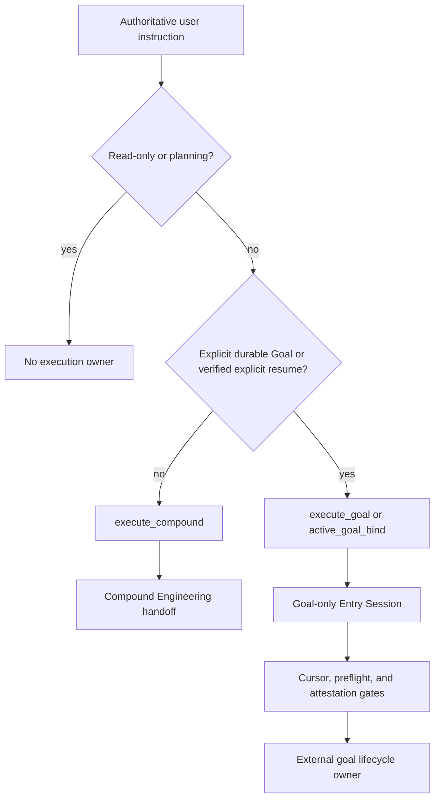

# Refactor Goal Entry to Compound-Default Routing

## Goal Capsule

- **Objective:** Make Compound Engineering the route for ordinary implementation while reserving `goal-entry` lifecycle, runtime-profile, and delegation contracts for explicitly requested durable Goals.
- **Product authority:** This plan replaces the public automatic-Goal routing behavior. `goal-entry` remains router-only; Compound Engineering and external `goal-*` owners retain their execution responsibilities.
- **Stop conditions:** Stop if a normal implementation request would need Goal state or delegation to preserve safety, or if the installed local policy cannot be synchronized without overwriting unrelated changes.
- **Execution profile:** Complete the source release first, then apply the matching policy to the local installed skill only after validation and scoped approval.
- **Tail ownership:** The implementation owner validates the source package and local policy. The main orchestrator owns review fixes, PR, CI, and the local deployment decision.

---

## Product Contract

### Summary

Routine engineering should hand off to Compound Engineering, not implicitly create a Goal or choose a Superpowers route.
Goal-specific authority checks remain available, but only after the request explicitly asks for a durable, long-horizon Goal lifecycle or an explicit resume of one verified Goal.

### Problem Frame

The resolver currently maps ordinary English and Chinese implementation requests to `execute_goal`, then selects a Superpowers tier, route, and execution mode.
An active Goal can also become the default destination for an otherwise unqualified request.
That turns a useful specialist control plane into the default engineering path and duplicates Compound Engineering's normal planning, implementation, debugging, review, and shipping workflows.

### Requirements

- R1. Ordinary English and Chinese implementation requests must resolve to `execute_compound` with a `compound_engineering` destination and `goal_action=none`.
- R2. An `execute_compound` result must be selected from the authoritative instruction before loading or validating Goal state, capabilities, cursors, candidate Goals, attestations, prior sessions, or readiness inputs; it must not create run artifacts or authorize delegation.
- R3. `execute_goal` must require an explicit durable Goal operation plus a long-horizon or autonomous outcome; task size, execution verbs, research terms, an active Goal, or quoted context alone are insufficient.
- R4. Resume/bind requires both explicit Goal-resume intent and verified Goal evidence. An active Goal plus bare `continue` must not bind by default.
- R5. Goal-only requests must preserve the existing no-execution veto, ambiguity fail-closed behavior, cursor revision checks, idempotency checks, provider-attestation gate, Runtime Profiles, and trace replay rules.
- R6. The public router must no longer expose or accept Superpowers tier, route, execution-mode, or direct-runtime controls. Delegation selection belongs to the explicit Goal child owner or Compound Engineering.
- R7. The public result must identify the destination without overloading a Superpowers field: `compound_engineering`, `goal_lifecycle`, or no execution owner.
- R8. Documentation and metadata must state that routine work starts with Compound Engineering and give clear bilingual examples of the narrower Goal opt-in contract.
- R9. This intentional public behavior break must release as `1.0.0`, with migration notes rather than a silent reinterpretation of version-1 projections.
- R10. A versioned machine-readable intent policy must define bilingual explicit Goal-operation, durable-outcome, and resume markers, plus precedence and hard-negative cases.

### Output Contract

| Request mode | `execution_destination` | `goal_action` | Goal-only envelopes |
| --- | --- | --- | --- |
| `execute_compound` | `compound_engineering` | `none` | Absent |
| `execute_goal` / `active_goal_bind` | `goal_lifecycle` | `create_goal`, `bind_active_goal`, or `fallback_handoff` | Present when the Goal route is qualified |
| Read-only, planning, copy, or advisory modes | `null` | `none` | Absent |

### Acceptance Examples

- AE1. Given “请修复这个解析器并补测试”, when resolved, then the result is `execute_compound`, names the Compound handoff, and contains no Goal authority envelope.
- AE2. Given “Please create a long-running autonomous Goal to reproduce this result and monitor it”, when resolved, then the result is `execute_goal` and preserves Goal lifecycle gating.
- AE3. Given an active Goal and “continue”, when no explicit Goal-resume wording is present, then the result does not bind or inspect Goal evidence.
- AE4. Given an explicit Goal-resume request with a stale verified cursor, when resolved, then the Goal path remains blocked and no fallback permits mutation.

### Scope Boundaries

**Deferred for later**

- Changing Compound Engineering's own execution internals or adding new Compound skills.
- Redesigning external `goal-dispatch` or `goal-team` implementations beyond their local policy activation boundary.

**Outside this product's identity**

- Moving scheduler, provider, milestone, or closeout behavior into `goal-entry`.
- Inferring durable Goal intent from a complex task, an active Goal, model context, or a Superpowers availability flag.

---

## Planning Contract

### Key Technical Decisions

- KTD1. **Use a distinct `execute_compound` request mode.** It makes the handoff auditable and prevents normal execution from being represented as a deferred Goal mutation.
- KTD2. **Make durable Goal intent conjunctive.** New Goal work needs both an explicit Goal operation and a durable/long-horizon signal; verified resume is explicit Goal-resume wording plus canonical evidence.
- KTD3. **Keep Entry Session and Runtime Profiles Goal-only.** Non-Goal outcomes omit those authority-bearing envelopes, so they cannot accidentally cause state lookup or provider negotiation.
- KTD4. **Remove Superpowers from the public router.** The resolver names a destination, while specific delegation remains owned by the selected executor.
- KTD5. **Publish a declarative intent policy.** Keep bilingual marker groups, precedence, and hard negatives in `references/entry_session_contract.json` so code and fixtures cannot silently diverge.
- KTD6. **Release a major version.** Existing documented outputs assign ordinary implementation to Goal lifecycle work, so the behavioral break is explicit at `1.0.0`.

### High-Level Technical Design

### Assumptions and Constraints

- The installed local skill stack is a separately managed deployment surface; source validation must finish before a scoped deployment write is requested.
- The Python standard library remains sufficient for deterministic routing and test fixtures.
- Existing Goal-only trace fixtures remain valid after their requests are made explicit.
- No external research is needed because the source package already contains the relevant router, contracts, tests, and release policy.

### System-Wide Impact

- **Public API:** Removes Superpowers routing projections and adds an explicit Compound destination for normal execution.
- **Safety:** Goal evidence is no longer parsed on ordinary requests, narrowing the mutation attack surface.
- **Executor boundary:** Compound Engineering owns normal engineering flow selection; `goal-*` child owners run only after explicit Goal qualification.
- **Release and deployment:** The source PR proves the versioned contract; local installed policy synchronization is a separately approved operational step.

### Risks and Mitigations

- **Unexpected caller breakage:** Publish a 1.0.0 migration note and assert the old automatic-GOAL examples now route to Compound Engineering.
- **False Goal activation:** Require conjunctive new-Goal markers and explicit verified-resume markers; add bilingual negative fixtures.
- **Safety regression on real Goals:** Keep cursor, attestation, idempotency, runtime-profile, and trace replay tests on explicit Goal requests.
- **Local/source drift:** Compare the installed resolver behavior against the source acceptance matrix before deployment, without modifying the unrelated dirty harness repository.
- **Deployment integrity:** Snapshot hashes for the named installed policy files before and after the approved local update, record the reviewed `1.0.0` source revision, and fail deployment if files outside that manifest change.

---

## Implementation Units

### U1. Split ordinary execution from explicit Goal lifecycle routing

- **Goal:** Establish a minimal public router that sends routine implementation to Compound Engineering and invokes Goal authority logic only after explicit durable Goal intent.
- **Requirements:** R1-R7, R10.
- **Dependencies:** None.
- **Files:** `scripts/resolve_goal_entry.py`, `references/entry_session_contract.json`, `tests/test_resolve_goal_entry.py`, `tests/test_entry_session_contract.py`, `tests/fixtures/routing_cases.json`, `tests/fixtures/entry_session_cases.json`, `tests/fixtures/capability_cases.json`, `tests/fixtures/composite_phase_cases.json`, `tests/fixtures/idempotency_cases.json`, `tests/fixtures/cursor_cases.json`, `tests/fixtures/attestation_cases.json`.
- **Approach:** Add the Compound execution mode and the `execution_destination` projection defined by the output contract; define durable-Goal and explicit-resume selectors through the versioned intent policy before lifecycle handling. Resolve an ordinary Compound route immediately after authoritative-instruction normalization, before loading any Goal-only input. Delete Superpowers-specific parser arguments, selector functions, and output fields. Build Entry Session, profile, lifecycle, cursor, idempotency, and attestation data only on qualified Goal routes.
- **Patterns to follow:** Pure resolver helpers and declarative JSON contracts already used by `scripts/resolve_goal_entry.py` and `references/runtime_profiles.json`.
- **Test scenarios:**
  - Covers AE1. English and Chinese ordinary implementation requests return the Compound destination with no Goal authority data.
  - Covers AE2. English and Chinese explicit durable Goal creation requests retain Goal preflight and profile behavior.
  - Covers AE3. Bare continuation, active state, quoted text, and removed delegation flags cannot select a Goal route.
  - Ordinary English and Chinese implementation requests paired with malformed, stale, spoofed, conflicting, or non-JSON Goal state, capability, cursor, candidate, attestation, prior-session, and readiness values still resolve successfully to `execute_compound` without parsing or emitting them.
  - Covers AE4. Explicit Goal resume still rejects missing, multiple, stale, spoofed, or expired canonical cursor evidence.
  - Existing Goal-only ambiguity, idempotency, phase graph, and attestation fixtures retain their fail-closed behavior after explicit intent wording is added.
- **Verification:** The resolver unit suite passes and no normal execution output contains Superpowers routing or Goal authority fields.

### U2. Align package validation and release artifacts with the new public contract

- **Goal:** Make source validation prove the new default and describe the major compatibility migration accurately.
- **Requirements:** R5-R9.
- **Dependencies:** U1.
- **Files:** `scripts/quick_validate.py`, `VERSION`, `CHANGELOG.md`.
- **Approach:** Replace automatic-Goal smoke assertions with a normal Compound smoke and a separate explicit-Goal safety smoke. Update the package version and changelog to state removed fields, the destination contract, and migration expectations. Define the deployment-manifest evidence required for the separately managed local stack: the named policy files are `goal-entry/SKILL.md`, `goal-entry/scripts/resolve_goal_entry.py`, `goal-plan/references/plan-builder.md`, and `goal-dispatch/SKILL.md`; record their before/after hashes and the reviewed source revision without copying the standalone package wholesale.
- **Patterns to follow:** Existing package-validator smoke structure and semantic-version policy in `README.md`.
- **Test scenarios:**
  - Package validation fails if a normal implementation request creates a Goal or exposes a removed Superpowers field.
  - Package validation fails if an explicit durable Goal request cannot reach the retained authority gate.
  - Version and changelog checks pass at `1.0.0`.
- **Verification:** `scripts/quick_validate.py` passes together with the full unittest suite and Goal runtime trace replay.

### U3. Rewrite public guidance around the two execution owners

- **Goal:** Make the user-facing skill contract short, bilingual-friendly, and unambiguous about when to use Compound Engineering versus Goal mode.
- **Requirements:** R6-R9.
- **Dependencies:** U1, U2.
- **Files:** `SKILL.md`, `README.md`, `references/architecture.md`, `agents/openai.yaml`.
- **Approach:** Replace Superpowers-first language and automatic execution routing with one small decision table: normal engineering to Compound Engineering; explicit durable Goal work to the Goal lifecycle. Keep router-only and Goal safety rules, but refer delegation choice to the downstream owner.
- **Patterns to follow:** The repository's router-only boundary in `AGENTS.md` and current validation wording in `SKILL.md`.
- **Test scenarios:**
  - Documentation examples match the resolver's Compound and explicit-Goal acceptance cases.
  - Public text contains no removed Superpowers routing contract or stale automatic-Goal examples.
- **Verification:** Source text audits, package validation, and manual comparison of the documented example outputs against resolver JSON pass.

---

## Verification Contract

| Gate | Evidence |
| --- | --- |
| Resolver behavior | `python3 -m unittest discover -s tests -v` |
| Goal lifecycle regression | `python3 scripts/validate_goal_runtime.py tests/fixtures/engineering_runtime_trace.json tests/fixtures/autoresearch_runtime_trace.json` |
| Package contract | `python3 scripts/quick_validate.py .` |
| Text and whitespace | `git diff --check` plus focused searches for removed Superpowers route fields |
| Local policy deployment | Verify the approved source revision; record before/after hashes for the four named policy files; run the installed resolver through AE1-AE4 and its own validator; fail if the scoped diff contains another file |

## Definition of Done

- U1-U3 are implemented and all verification-contract gates pass.
- Ordinary implementation requests route only to Compound Engineering and never initiate Goal authority processing.
- Explicit durable Goal creation and verified explicit resume retain the existing fail-closed lifecycle protections.
- The source package declares `1.0.0` and documents the breaking migration.
- Review findings are resolved or durably recorded before shipping.
- The clean source repository is committed, pushed, and represented by a PR; local installed policy is synchronized only through an approved, validated deployment step.
- The local deployment evidence identifies the source revision and the before/after hashes for exactly the approved policy files.
