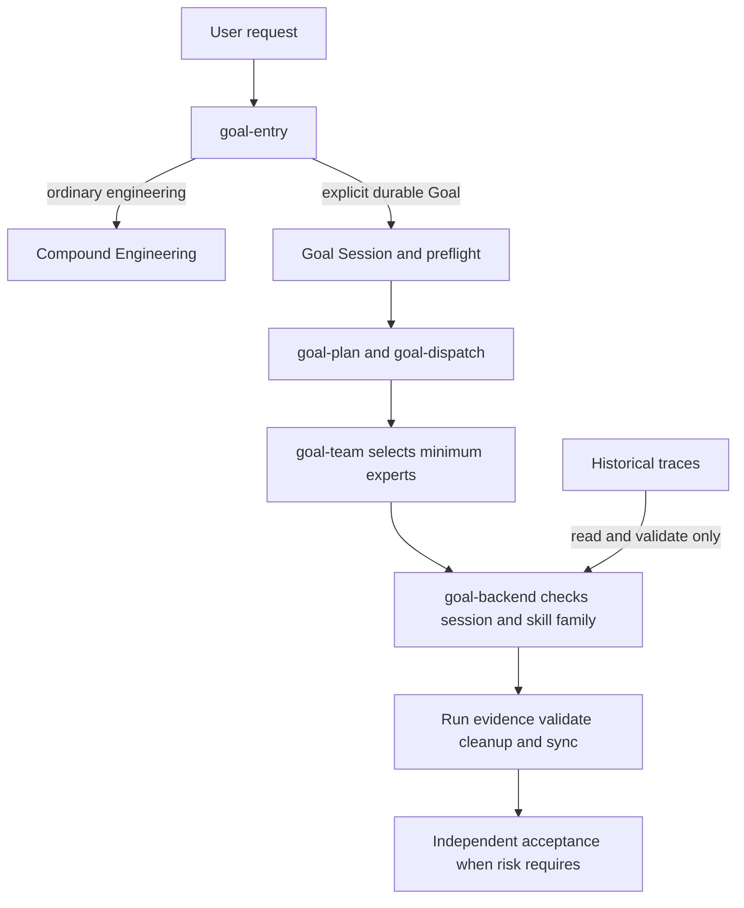
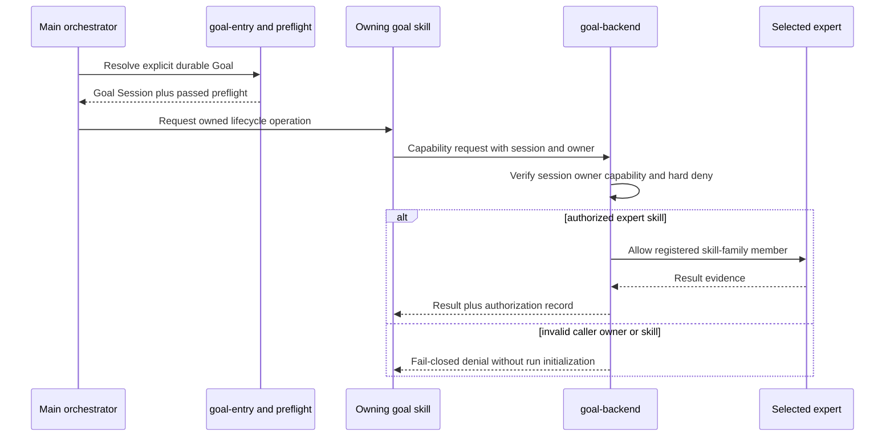
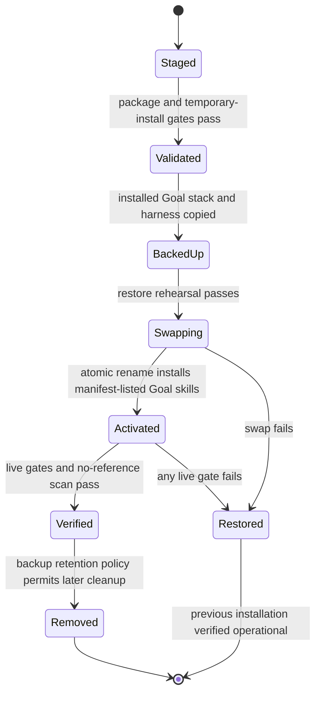

# Goal Backend Harness Removal - Plan

> **Historical baseline.** This plan records the completed removal of the
> `harness-agent` identity and the migration of its retained capabilities into
> the co-located Goal family. Its explicit-Goal-only routing and separate-repo
> assumptions are superseded by
> `2026-07-13-002-refactor-model-native-goal-entry-plan.md`: the public skill is
> now an explicitly invoked, model-native direct/Compound/Goal router, and the
> same atomic installer owns both `goal-entry` and its Goal family. The detailed
> migration evidence below is preserved intentionally.

## Goal Capsule

- **Objective:** Remove `harness-agent` as a skill and directory, move its retained execution and evidence capabilities into a Goal-session-gated `goal-backend`, and provide a controlled expert system for explicit Goal work.
- **Product authority:** This Product Contract governs Goal/backend ownership, retained capabilities, expert permissions, legacy trace compatibility, full-stack cutover, and release acceptance.
- **Open blockers:** None at the product level. Planning must inventory every current `harness-agent` consumer, define the initial skill-family membership, and identify the canonical source for each installed `goal-*` surface before implementation.

---

## Product Contract

### Summary

Build one explicit-Goal execution stack in which `goal-entry` authorizes the Goal Session, `goal-*` skills own lifecycle decisions, and `goal-backend` supplies mechanical runtime capabilities plus expert-permission enforcement.
Remove the entire `harness-agent` directory only after the local Goal stack passes an atomic cutover gate; ordinary engineering remains on Compound Engineering.

### Problem Frame

The public `goal-entry` contract now sends ordinary engineering to Compound Engineering and reserves Goal lifecycle work for explicit durable Goal creation or resume.
The installed Goal stack still depends on a broad `harness-agent` surface that combines backend scripts, trace contracts, mode selection, Superpowers-first policy, expert metadata, and standalone orchestration instructions.

This leaves two competing control planes and forces Goal child skills to reference a package whose public identity no longer matches the router-only architecture.
It also exposes more modes, policies, artifacts, and skills than a bounded Goal operation needs.

### Key Decisions

- **Remove rather than quarantine.** The `harness-agent` skill and directory leave the installed surface after required capabilities and consumers migrate; there is no permanent compatibility entry.
- **Gate backend access with the Goal Session.** Only the main orchestrator may use `goal-backend`, through an owning `goal-*` skill, after `goal-entry` selects Goal lifecycle and `goal-preflight` passes.
- **Keep policy outside the backend.** `goal-plan`, `goal-dispatch`, and `goal-team` own planning, provider choice, expert selection, and dispatch; `goal-backend` owns capability execution and permission enforcement.
- **Use a curated expert catalog.** Nine stable expert classes form the first release and are selected in the smallest useful combination.
- **Authorize by controlled skill family.** Experts receive reviewed skill families rather than per-task free-form lists; new installed skills receive no expert permission automatically.
- **Read old, write new.** Historical traces remain readable and validatable, while new runs record Goal-owned semantics and do not preserve old orchestration authority.
- **Cut over the whole Goal stack atomically.** No installed `goal-*` consumer may retain a required `harness-agent` path when the old directory is removed.



### Actors

- A1. **Goal Owner:** Explicitly creates or resumes the durable Goal and retains authority over its objective and risk boundary.
- A2. **Main Orchestrator:** Holds the Goal Session, invokes `goal-*` owners, and is the only actor allowed to reach `goal-backend`.
- A3. **Goal Control Skills:** `goal-plan`, `goal-dispatch`, and `goal-team` decide work shape, provider, expert selection, and dispatch without delegating those decisions to the backend.
- A4. **Goal Backend:** Executes authorized mechanical capabilities, enforces expert permissions, records evidence, and rejects calls outside the verified Goal Session.
- A5. **Primary Expert:** Performs one bounded unit using only the skill families granted to its expert class.
- A6. **Independent Verifier:** Did not perform the governed high-risk unit and returns acceptance evidence from an allowed verification, review, reliability, or security role.

### Requirements

**Ownership and access**

- R1. Ordinary engineering requests must continue to route to Compound Engineering without initializing Goal state or backend artifacts.
- R2. `goal-backend` must accept work only from the main orchestrator through an owning `goal-*` skill after `goal-entry` selects Goal lifecycle and `goal-preflight` passes.
- R3. Direct user, Compound Engineering, unrelated-skill, and subagent calls to `goal-backend` must fail closed without producing run artifacts.
- R4. `goal-backend` must not select plans, providers, experts, teams, dispatch order, or retry policy.
- R5. Goal tools and Goal/backend orchestration skills must remain main-orchestrator-only.

**Retained backend capabilities**

- R6. `goal-backend` must provide Goal run initialization, evidence recording, trace validation, runtime cleanup, Goal sync, and historical trace reading.
- R7. Each backend capability must require the current Goal Session and the owning `goal-*` authority appropriate to that capability.
- R8. Backend results must distinguish completed evidence from missing, partial, failed, blocked, and readiness-only evidence.
- R9. New Goal runs must use Goal-owned lifecycle and dispatch semantics rather than historical harness mode or Superpowers-first authority fields.

**Harness removal and compatibility**

- R10. The complete `harness-agent` skill and directory must be absent after successful cutover.
- R11. Required scripts, validators, schemas, fixtures, and artifact readers must move under the ownership of `goal-backend` or the relevant `goal-*` skill before removal.
- R12. Every installed `goal-*` skill, validator, document, and generated surface that requires a `harness-agent` path must migrate in the same cutover.
- R13. Representative historical traces must remain readable and validatable after migration without preserving old executable script paths.
- R14. Historical run replay that depends on the deleted runtime or script layout is not a compatibility guarantee.
- R15. Goal-scoped, auto, discussion, debate, maintenance, and other historical harness modes must not migrate into `goal-backend`.

**Expert catalog and permissions**

- R16. The first release must define nine expert classes: Implementation; Debugging; Test and Verification; Architecture and Code Review; Research and Experiment; Documentation and Communication; Release and Reliability; Security and Risk; Frontend and UI Engineering.
- R17. `goal-backend` must own the expert definitions, controlled skill-family registry, permission checks, and permission evidence, while Goal control skills own expert selection and dispatch.
- R18. Expert selection must begin with one primary expert and add specialists only when the work crosses domains or requires independent acceptance.
- R19. Each skill family must have explicitly reviewed membership, and newly installed skills must remain unavailable to experts until registered.
- R20. A global hard deny must prevent every expert family from invoking Goal tools, `goal-*` protocol skills, `goal-backend`, or reserved orchestration skills.
- R21. Backend authorization must reject expert skill calls outside the selected expert's registered families and record the decision for trace validation.
- R22. Code changes, experiment conclusions, releases, and security claims must be accepted by an eligible expert who did not execute the governed work unit.
- R23. Read-only analysis and low-risk preparation may use primary-expert self-checks when no completion, release, experiment, or security claim depends on them.

**Release and rollback**

- R24. Cutover must be atomic across the public router, installed Goal skills, backend capabilities, expert registry, validators, documentation, and generated metadata.
- R25. The old installation must remain recoverable until the new stack passes all release gates and a restoration exercise succeeds.
- R26. Any failed release gate must stop deletion and leave the previous installed Goal stack operational.

### Key Flows

- F1. Ordinary engineering bypass
  - **Trigger:** A request asks for bounded implementation, debugging, review, testing, documentation, or planning without an explicit durable Goal operation.
  - **Actors:** A1, A2
  - **Steps:** `goal-entry` selects Compound Engineering and does not create a Goal Session or backend artifacts.
  - **Outcome:** The Goal backend and expert catalog remain unloaded.

- F2. Explicit Goal backend activation
  - **Trigger:** The Goal Owner explicitly creates or resumes a durable Goal.
  - **Actors:** A1, A2, A3, A4
  - **Steps:** `goal-entry` selects Goal lifecycle; preflight establishes readiness; an owning Goal skill requests one backend capability within the Goal Session.
  - **Outcome:** The backend executes or returns a non-mutating denial with evidence.

- F3. Minimum expert execution
  - **Trigger:** A Goal work unit requires domain execution.
  - **Actors:** A2, A3, A4, A5
  - **Steps:** Goal control selects one primary expert; the backend resolves the expert's registered skill families and enforces the hard deny before each skill call.
  - **Outcome:** Only authorized skill use is recorded as valid execution evidence.

- F4. Risk-based independent acceptance
  - **Trigger:** A unit supports a code, experiment, release, or security completion claim.
  - **Actors:** A2, A3, A4, A5, A6
  - **Steps:** Goal control selects a non-implementing verifier; the backend enforces its families; trace and closeout require its acceptance evidence.
  - **Outcome:** The unit cannot self-accept a high-risk result.

- F5. Historical trace validation
  - **Trigger:** A user or Goal owner needs evidence from a pre-cutover run.
  - **Actors:** A2, A3, A4
  - **Steps:** A Goal-owned validation path gives the old artifact set to the compatibility reader; the backend validates supported semantics without invoking deleted scripts.
  - **Outcome:** The trace receives a supported, partial, invalid, or unsupported-replay result without being rewritten as a new run.

- F6. Atomic cutover and rollback
  - **Trigger:** The migrated Goal stack is ready for installation.
  - **Actors:** A2, A3, A4
  - **Steps:** The stack runs the complete release matrix and restoration exercise; successful evidence permits removal, while any failure preserves or restores the old installation.
  - **Outcome:** No installed state exists in which required Goal consumers point to a missing harness directory.

### Acceptance Examples

- AE1. **Covers R1, R3.** Given an ordinary implementation request, when `goal-entry` resolves it, then Compound Engineering receives it and no Goal/backend artifact is created.
- AE2. **Covers R2, R3.** Given a direct `goal-backend` request without a verified Goal Session, when authorization runs, then the call is rejected before any artifact or expert is initialized.
- AE3. **Covers R6, R7.** Given a ready explicit Goal Session and an authorized trace-validation request from `goal-trace`, when the backend runs, then it returns evidence tied to that Goal and owning skill.
- AE4. **Covers R19-R21.** Given a Frontend and UI Engineering expert whose family excludes a release skill, when that expert requests the release skill, then the backend denies and records the attempt.
- AE5. **Covers R20.** Given any expert family, when it requests a Goal tool, protocol skill, backend skill, or reserved orchestration skill, then authorization rejects the call regardless of family membership.
- AE6. **Covers R22, R23.** Given a code change implemented by the Implementation Expert, when completion is evaluated, then that expert's self-check cannot replace independent acceptance; a read-only analysis may still finish with a self-check.
- AE7. **Covers R13-R15.** Given a representative historical trace, when the new compatibility reader validates it, then supported evidence remains inspectable without reactivating its historical mode or script path.
- AE8. **Covers R10-R12, R24-R26.** Given one required Goal consumer still references the old harness directory or one restoration check fails, when cutover is evaluated, then deletion is blocked and the old installation remains recoverable.

### Scope Boundaries

**Outside this release**

- Historical harness modes, standalone harness execution, automatic provider selection, and backend-owned planning or team formation.
- Runtime Extensions, a Contract Compiler, automatic skill-family classification, and automatic permission for newly installed skills.
- Full executable replay of historical runs or preservation of legacy script paths after directory removal.

**Outside this product's identity**

- Using `goal-backend` as a second public router or a replacement for Compound Engineering.
- Allowing experts or subagents to own Goal state, call Goal tools, alter their own permissions, or accept their own high-risk work.

### Dependencies and Assumptions

- The existing Goal Entry Session and preflight decisions can provide a trustworthy authorization boundary to backend calls.
- Representative historical traces and current Goal-run fixtures are available for compatibility qualification.
- Planning can identify canonical editable sources for every installed `goal-*` surface before changing the local installation.
- The skill inventory can distinguish registered skill-family members from reserved protocol and orchestration skills.

### Success Criteria

- All twenty-six requirements and eight acceptance examples pass together; no compatibility or restoration item is a post-release follow-up.
- The installed surface contains no `harness-agent` skill or directory and no required `goal-*` consumer points to it.
- Ordinary engineering behavior remains unchanged, while explicit Goal runs retain the six approved backend capability classes.
- The nine-expert catalog, controlled families, global hard deny, minimum-team rule, and independent-acceptance rule are mechanically enforceable and trace-visible.

---

## Planning Contract

- **Target repository:** `codex-harness-engineer-agent` is the canonical editable source and release vehicle for the migrated Goal stack. Its historical repository name may remain, but its installable surface becomes `skills/goal-*`; it no longer exposes a root `harness-agent` skill.
- **Control plan:** This file remains the LFG execution plan even though it lives in the `codex-goal-entry` repository. Implementation paths below are relative to the target repository unless stated otherwise.
- **Source baseline:** Implement from a clean worktree at `origin/main`. Treat the dirty local checkout and the current installed `~/.codex/skills` tree as discovery inputs only; copy only reviewed contracts or retained capability logic, never unrelated local residue.
- **Installed surface:** The release installer owns the local `goal-*` stack as one manifest. `goal-entry` remains sourced from its router repository; the target package owns `goal-preflight`, `goal-context`, `goal-objective`, `goal-plan`, `goal-dispatch`, `goal-team`, `goal-backend`, `goal-trace`, `goal-metadata`, and `goal-close`.
- **Router participation:** `goal-entry` is unchanged by this target-repository implementation, but its live resolver output and ordinary-engineering bypass are release preconditions. R24's router atomicity means an incompatible router blocks activation; the installer does not copy or replace the separately sourced router.
- **Compatibility boundary:** Preserve semantic read/validation support for representative legacy traces. Do not preserve the old skill entrypoint, modes, provider policy, root script paths, or executable replay.
- **Delivery strategy:** Build and verify in a temporary install root, run backup-and-restore rehearsal, then perform one atomic local installation. Delete the live `harness-agent` directory only inside the committed installer transaction after every pre-delete gate passes.
- **Implementation depth:** Deep. The change combines an authorization boundary, schema/trace compatibility, destructive package removal, and a multi-skill cutover.
- **Implementation order:** Characterize and package first; add the gated backend; add expert permissions; migrate all Goal consumers; qualify legacy reads; add atomic installation; remove the old public surface last.

## Technical Design

### Ownership map

| Surface | Owns | Must not own |
|---|---|---|
| `goal-entry` | Ordinary-versus-durable routing and Goal Session creation/resume gate | Execution artifacts, expert selection, provider policy |
| `goal-preflight` | Readiness decision and non-mutating blockers | Backend initialization, dispatch |
| `goal-plan` | Work decomposition and acceptance shape | Capability execution |
| `goal-dispatch` | Provider-neutral dispatch decision and integration boundaries | Backend authorization policy |
| `goal-team` | Minimum expert selection and independent-verifier selection | Permission mutation, dispatch execution |
| `goal-backend` | Session authorization, six mechanical capabilities, expert/family enforcement, permission evidence | Planning, provider choice, expert selection, retry policy |
| `goal-trace` | Validation policy and evidence interpretation | Trace mutation or invented evidence |
| `goal-close` | Cleanup/validation/sync sequencing and completion gate | Goal completion by subagents |
| `goal-metadata` | Registry generation, installed-manifest checks, drift reporting | Automatic permission grants |

### Package layout

```text
skills/
  goal-preflight/
  goal-context/
  goal-objective/
  goal-plan/
  goal-dispatch/
  goal-team/
  goal-backend/
    SKILL.md
    references/
      backend-map.md
      artifact-contract.md
      expert-registry.json
      skill-family-registry.json
      schemas/
    scripts/
  goal-trace/
  goal-metadata/
  goal-close/
scripts/
  install_goal_stack.py
  check_goal_stack.py
tests/
  fixtures/
  test_*.py
```

The root deliberately has no `SKILL.md`. Installation copies only manifest-listed `skills/goal-*` directories. Retained runtime code lives below `skills/goal-backend/scripts/`; top-level scripts are release and repository-validation tools, not a discoverable skill.

### Authorization flow



The backend authorization input is explicit and serializable: current Goal identifier, Goal Entry decision, passed preflight evidence, owning `goal-*` skill, requested capability, actor type, selected expert identifier when applicable, and requested skill. The backend recomputes the resolver/preflight fingerprints and requires the session identifier, request fingerprint, Goal identifier/cursor, and owner/capability relation to agree before any run directory or mutable artifact is created.

This is a Goal protocol and evidence boundary, not an operating-system security sandbox. It reliably rejects missing, inconsistent, stale, or out-of-contract invocations and makes misuse trace-visible; a local process with permission to rewrite every input and execute package code is outside the threat model. Tests and documentation must not claim stronger caller identity than the host runtime can establish.

### Capability facade

Define exactly six public backend capability identifiers and map every migrated helper to one of them:

| Capability | Owning callers | Output boundary |
|---|---|---|
| `run.initialize` | `goal-context`, `goal-dispatch` | New Goal-owned manifest and run directory |
| `evidence.record` | `goal-dispatch`, `goal-team`, authorized execution | Append-only evidence and authorization decisions |
| `trace.validate` | `goal-trace`, `goal-close` | Completed/missing/partial/failed/blocked/readiness-only result |
| `runtime.cleanup` | `goal-close` | Reconciled handle and cleanup evidence |
| `goal.sync` | `goal-close` | Pre-update and post-update Goal synchronization evidence |
| `trace.read_legacy` | `goal-trace` | Supported/partial/invalid/unsupported-replay result, without mutation |

Use a table-driven owner-to-capability matrix. Unknown capability names and unknown owner/capability pairs deny by default.

### Expert and skill-family model

`skills/goal-backend/references/expert-registry.json` defines the nine stable expert identifiers, human-readable names, allowed family identifiers, eligible independent-acceptance claim types, and registry version. `skills/goal-backend/references/skill-family-registry.json` defines reviewed family membership and a top-level `global_deny` list/pattern set.

The initial family taxonomy is intentionally smaller than the installed skill inventory:

| Family | Intended membership class | Typical expert consumers |
|---|---|---|
| `implementation` | Bounded implementation and code simplification skills | Implementation, Frontend |
| `debugging` | Diagnosis and error-recovery skills | Debugging |
| `verification` | Tests, proof, review, and quality skills | Test, Architecture, Release, Security |
| `architecture` | Design, interface, modeling, and code-review skills | Architecture |
| `research` | Research, experiment, analysis, and plotting skills | Research |
| `documentation` | Documentation and communication skills | Documentation |
| `release` | Versioning, CI, PR, deployment, and reliability skills | Release |
| `security` | Security and risk-assessment skills | Security |
| `frontend` | Frontend engineering, interface design, and browser-test skills | Frontend |

The registry stores explicit skill names; the class descriptions are review guidance, not runtime classifiers. A generator may report unclassified installed skills but must never add them. The hard deny wins over all family membership and includes Goal tools, every `goal-*` skill, `goal-backend`, Goal creation/update operations, and reserved orchestration/provider skills.

### New trace semantics and legacy adapter

New runs use a Goal-owned manifest version and events that identify Goal Session, owning skill, capability, actor/expert, authorization result, evidence status, and optional independent-acceptance relationship. They contain no authoritative `harness_mode`, Superpowers-first, debate/discussion, or maintenance-mode field.

Legacy input detection remains read-only. The adapter recognizes representative existing harness manifests/events, normalizes only fields required for evidence inspection, and emits compatibility diagnostics. It must not write into the legacy directory, execute stored commands, load old provider policy, or translate an old mode into new dispatch authority.

### Atomic installation lifecycle



The installer accepts explicit source, destination, and backup roots and supports `--dry-run`. It stages on the same filesystem as the destination, validates before swap, backs up every replaced `goal-*` directory plus `harness-agent`, and removes `harness-agent` only as part of the successful swap. Any exception restores the exact pre-install set and verifies it. Tests never mutate the real home directory.

Because the Codex skill root contains unrelated sibling skills, the cutover is transactional rather than a literal single-filesystem rename of the entire parent. It holds an exclusive Goal-stack install lock, requires Goal execution to be quiescent, replaces only manifest-owned entries, and guarantees a fully old or fully new validated state when the command exits. Documentation requires starting a fresh Codex task after activation so no running task mixes contracts loaded before and after the transaction.

## Implementation Units

### U1. Establish the multi-skill package and characterize the current boundary

- **Requirements:** R1, R10-R12, R24
- **Files:** `AGENTS.md`; `skills/goal-*/SKILL.md`; `skills/goal-*/agents/openai.yaml`; `skills/goal-*/references/**`; `scripts/check_goal_stack.py`; `tests/test_package_contract.py`; `tests/fixtures/current-installed-contract/**`; `.github/workflows/ci.yml`
- **Work:**
  - Add a minimal root `AGENTS.md` for repository scope and define the target as a Goal-stack distribution.
  - Seed the ten backend/control `goal-*` packages from reviewed installed contracts, excluding `goal-entry`, then replace absolute installation references with package-relative or manifest-resolved paths.
  - Add an explicit package manifest consumed by validation and installation; assert that the repository root has no discoverable `SKILL.md` and no manifest entry named `harness-agent`.
  - Capture characterization fixtures for the current installed caller/capability relationships and the legacy traces selected for U5. Fixtures must contain no machine-specific secrets or unrelated dirty-tree content.
  - Replace harness-named CI entrypoints with package validation and unit-test commands across Python 3.8, 3.11, and 3.12.
  - Record a source-to-destination migration map: `init_harness_run.py` to `init_goal_run.py`; goal binding, skill preflight, subagent lifecycle, and authorization records to `record_goal_evidence.py`; runtime/startup cleanup and inactive-handle reclamation to `reclaim_runtime_handles.py`; `finalize_goal_sync.py` to its Goal-owned equivalent; core trace/events/cleanup validation to `validate_goal_trace.py`; and query-only legacy parsing to `read_legacy_trace.py`. Do not port auto, debate, discussion, deep-report, hook, replay, or runtime-team modules.
- **Tests:** Package manifest enumerates exactly the intended Goal skills; every package passes skill validation; no required file contains an absolute `harness-agent` path; root skill discovery cannot find `harness-agent`.
- **Verification:** `python3 scripts/check_goal_stack.py .`; `python3 -m unittest discover -s tests -p 'test_*.py'`.

### U2. Implement the Goal-session-gated six-capability backend

- **Requirements:** R2-R9
- **Files:** `skills/goal-backend/SKILL.md`; `skills/goal-backend/references/backend-map.md`; `skills/goal-backend/references/artifact-contract.md`; `skills/goal-backend/references/schemas/**`; `skills/goal-backend/scripts/authorize_backend_call.py`; `skills/goal-backend/scripts/init_goal_run.py`; `skills/goal-backend/scripts/record_goal_evidence.py`; `skills/goal-backend/scripts/validate_goal_trace.py`; `skills/goal-backend/scripts/reclaim_runtime_handles.py`; `skills/goal-backend/scripts/finalize_goal_sync.py`; `tests/test_backend_authorization.py`; `tests/test_backend_capabilities.py`
- **Work:**
  - Introduce a table-driven authorization gate that validates actor, Goal Session, resolver decision, passed preflight, owning skill, and capability before mutation.
  - Port only logic needed for the six approved capability classes. Rename public commands and schema fields to Goal semantics; share internal parsing helpers rather than preserving root compatibility wrappers.
  - Make evidence status an enum covering completed, missing, partial, failed, blocked, and readiness-only.
  - Keep capability entrypoints deterministic and CLI-testable with explicit filesystem arguments.
- **Tests:** Direct user, Compound, unrelated skill, subagent, missing-session, failed-preflight, unknown-owner, and wrong-owner calls deny before filesystem mutation; each valid owner/capability pair succeeds; unknown capabilities deny; new manifests contain no historical mode authority.
- **Verification:** `python3 -m unittest tests.test_backend_authorization tests.test_backend_capabilities` plus schema validation through `scripts/check_goal_stack.py`.

### U3. Add curated experts, controlled skill families, and independent acceptance

- **Requirements:** R16-R23
- **Files:** `skills/goal-backend/references/expert-registry.json`; `skills/goal-backend/references/skill-family-registry.json`; `skills/goal-backend/scripts/authorize_expert_skill.py`; `skills/goal-backend/scripts/check_independent_acceptance.py`; `skills/goal-metadata/SKILL.md`; `skills/goal-metadata/references/metadata-refresh.md`; `skills/goal-metadata/scripts/update_skill_inventory.py`; `skills/goal-metadata/scripts/update_expert_registry.py`; `skills/goal-metadata/scripts/generate_goal_stack_health.py`; `tests/test_expert_registry.py`; `tests/test_expert_authorization.py`; `tests/test_independent_acceptance.py`
- **Work:**
  - Define exactly nine versioned expert records and explicit, reviewed skill-family membership.
  - Enforce precedence as global hard deny, known expert, selected family, explicit skill membership, then allow; every decision produces appendable permission evidence.
  - Report installed-but-unregistered skills as metadata drift without granting access.
  - Require a distinct eligible verifier identity for code, experiment, release, and security completion claims; permit self-check only for low-risk/read-only work.
- **Tests:** Exactly nine roles exist; a new synthetic installed skill is denied; a family member is allowed; a denied Goal/reserved skill remains denied even if inserted into a family fixture; wrong-family requests deny; executor identity cannot independently accept its own governed claim; an eligible distinct verifier can.
- **Verification:** `python3 -m unittest tests.test_expert_registry tests.test_expert_authorization tests.test_independent_acceptance`.

### U4. Migrate every Goal control skill to the new backend contract

- **Requirements:** R1-R5, R7, R11-R12, R17-R18, R22
- **Files:** `skills/goal-preflight/**`; `skills/goal-context/**`; `skills/goal-objective/**`; `skills/goal-plan/**`; `skills/goal-dispatch/**`; `skills/goal-team/**`; `skills/goal-trace/**`; `skills/goal-metadata/**`; `skills/goal-close/**`; `tests/test_goal_consumer_contracts.py`; `tests/test_minimum_team_policy.py`
- **Work:**
  - Remove Superpowers-first and historical mode language from planning and dispatch contracts. Keep dispatch provider-neutral and make any provider choice an orchestrator decision recorded through `evidence.record`.
  - Replace preset-based broad team formation with one-primary-expert selection plus cross-domain or independent-verifier additions.
  - Give each owning skill only its declared capability calls; keep Goal tools and all Goal/backend protocol skills out of expert/subagent permissions.
  - Update trace and closeout to require independent acceptance for governed claim types and to interpret all evidence statuses without prose substitution.
  - Update metadata refresh to validate explicit registries and install-manifest drift, never auto-classify skills.
- **Tests:** A static consumer graph has no `harness-agent` references; every backend call has a declared owner/capability pair; dispatch contains no default provider; minimum team stays one for single-domain low-risk work and adds only justified specialists; Goal protocol skills never appear in expert permissions.
- **Verification:** `python3 -m unittest tests.test_goal_consumer_contracts tests.test_minimum_team_policy`; `rg -n 'harness-agent|harness_mode|Superpowers-first|superpowers_subagents' skills scripts tests` returns only explicitly marked legacy fixtures or compatibility parser tests.

### U5. Qualify read-only legacy trace compatibility

- **Requirements:** R8-R9, R13-R15
- **Files:** `skills/goal-backend/scripts/read_legacy_trace.py`; `skills/goal-backend/scripts/validate_goal_trace.py`; `skills/goal-backend/references/legacy-trace-compatibility.md`; `tests/fixtures/legacy-traces/**`; `tests/test_legacy_trace_compatibility.py`
- **Work:**
  - Select representative valid and invalid legacy trace fixtures from the current package and reduce them to the minimum non-sensitive artifact set.
  - Detect legacy manifests explicitly, normalize evidence status and supported lifecycle facts, and surface unsupported replay separately from invalid evidence.
  - Prohibit mutations, subprocess replay, stored-command execution, provider restoration, and old-mode activation in the compatibility reader.
- **Tests:** Representative old traces produce supported, partial, invalid, and unsupported-replay outcomes; fixture trees remain byte-identical after reads; mode/provider fields cannot authorize new work; missing old script paths do not prevent semantic inspection.
- **Verification:** `python3 -m unittest tests.test_legacy_trace_compatibility` and checksum comparison built into the test.

### U6. Build atomic install, rollback, and installed-state validation

- **Requirements:** R10-R12, R24-R26
- **Files:** `goal-stack-manifest.json`; `scripts/install_goal_stack.py`; `scripts/check_goal_stack.py`; `tests/test_installer_transaction.py`; `tests/test_installed_surface.py`; `docs/installation.md`; `docs/rollback.md`
- **Work:**
  - Implement manifest-driven dry-run, staging, validation, backup, same-filesystem swap, post-install validation, rollback, and restoration verification.
  - Make destination and backup roots required/explicit in testable library functions; use the real Codex skills root only when the caller explicitly selects live installation.
  - Canonicalize and constrain every manifest path below its declared root; reject `..`, absolute manifest entries, symlinked managed entries, symlinked destination/backup roots, ownership mismatches, and an already-held install lock. Create backups with owner-only permissions.
  - Scan all installed Goal packages for dangling required paths before allowing old-directory deletion.
  - Retain the backup until all live release gates pass; report its path and do not silently prune it.
- **Tests:** Temporary-root fresh install, upgrade, forced pre-swap failure, forced mid-swap failure, forced post-install failure, explicit restore, concurrent-lock rejection, path-traversal rejection, and symlink rejection all produce one coherent old or new state; no mixed state is observable after command exit; failed gates retain/restore `harness-agent`; successful install removes it and leaves no required reference.
- **Verification:** `python3 -m unittest tests.test_installer_transaction tests.test_installed_surface`; two consecutive dry runs are identical.

### U7. Remove harness identity, finish documentation, and execute release gates

- **Requirements:** R1, R10, R14-R15, R24-R26
- **Files removed:** root `SKILL.md`; `agents/openai.yaml`; historical mode references; historical mode scripts; replay/runtime-team examples; eval cases whose only contract is auto/discussion/debate/maintenance/standalone harness execution.
- **Files updated:** `README.md`; `docs/README.zh-CN.md`; `docs/concepts.md`; `docs/quickstart.md`; `CHANGELOG.md`; `SECURITY.md`; `.github/pull_request_template.md`; `.github/workflows/ci.yml`; `tests/test_removed_surface.py`
- **Work:**
  - Delete the discoverable harness skill and all non-retained orchestration modes after their retained logic has test coverage under earlier units.
  - Rewrite documentation around explicit Goal Sessions, the six backend capabilities, nine experts, controlled families, legacy read-only support, and atomic installation.
  - Add a negative inventory test over source, package manifest, staged install, and live install so historical terms are allowed only in compatibility documentation/fixtures/tests.
  - Run the complete gate matrix in a temporary install, a restoration rehearsal, and then the real local install.
- **Tests:** No root skill entrypoint or installed `harness-agent` directory exists after success; deleted mode entrypoints cannot be imported or invoked; all documented commands exist; package/source/installed manifests agree.
- **Verification:** Full Verification Contract below.

## Verification Contract

### Release gates

All eight gates are mandatory and ordered. Failure stops the release; gates 1-6 run before live deletion, gate 7 performs the transactional cutover, and gate 8 verifies the resulting live state.

1. **Source/package gate:** Validate every Goal skill, JSON document, schema, Python file, manifest entry, and documentation command from a clean checkout.
2. **Authorization gate:** Pass caller/session/preflight/owner/capability denials, valid capability pairs, global hard deny, unregistered-skill denial, and permission-evidence tests.
3. **Behavior gate:** Pass ordinary-engineering bypass, six capability classes, minimum-team selection, and independent-acceptance scenarios.
4. **Compatibility gate:** Pass representative legacy supported/partial/invalid/unsupported-replay cases and prove the reader does not mutate or execute them.
5. **Reference/removal gate:** Prove all required Goal consumers are free of old paths and historical execution authority; prove removed mode entrypoints are absent.
6. **Staged-install and restore gate:** Install into a temporary skills root, validate it, rehearse backup restoration, and validate the restored old state.
7. **Transactional live-cutover gate:** Quiesce Goal execution, acquire the exclusive install lock, back up the current local Goal stack and `harness-agent`, stage on the destination filesystem, install the manifest-listed Goal packages, remove the old directory inside the transaction, and auto-restore on failure.
8. **Live conformance gate:** Run skill validation, installed-manifest/source drift checks, ordinary bypass, unauthorized backend denial, one authorized backend smoke case, legacy read smoke case, and `harness-agent` absence check against the live installation.

### Core commands

```bash
python3 scripts/check_goal_stack.py .
python3 -m unittest discover -s tests -p 'test_*.py'
python3 -m py_compile scripts/*.py skills/goal-backend/scripts/*.py
python3 scripts/install_goal_stack.py --source . --destination-root <temporary-skills-root> --backup-root <temporary-backup-root> --dry-run
python3 scripts/install_goal_stack.py --source . --destination-root <temporary-skills-root> --backup-root <temporary-backup-root>
```

The live command uses the same installer with explicit real destination and backup roots only after gates 1-6 pass. Record every command, exit status, backup path, and installed manifest digest in the release evidence.

### Evidence mapping

| Claim | Required evidence |
|---|---|
| Harness skill is removed | Source discovery, manifest, staged install, and live filesystem checks |
| Backend is private and gated | Negative caller/session/preflight/owner tests plus no-mutation assertion |
| Six capabilities survived | One valid owner-path test and artifact assertion per capability |
| Expert permissions are controlled | Registry validation, global-deny precedence, new-skill denial, decision records |
| High-risk work is independently accepted | Distinct executor/verifier identity and eligible claim-family evidence |
| Legacy traces remain readable | Representative compatibility matrix and non-mutation checksum |
| Cutover is recoverable | Forced-failure transaction tests and successful restoration rehearsal |
| Ordinary engineering remains Compound-owned | Router regression test from the `codex-goal-entry` package plus no Goal artifact assertion |

## Risks and Mitigations

- **Canonical-source drift:** Installed `goal-*` files may be ahead of tracked sources. Seed only reviewed contracts, record their origin in characterization fixtures, and make the new repository package canonical before live installation.
- **Dirty-checkout contamination:** Build from a clean worktree at `origin/main`; never stage from the existing dirty checkout; inspect the final diff for unexpected local-only files.
- **Authorization spoofing:** Do not accept a caller-supplied string alone. Require the complete Goal Session/preflight/owner envelope and test mutation occurs only after authorization. Document that orchestration identity is a local protocol boundary, not an operating-system security sandbox.
- **Accidental permission expansion:** Keep family membership explicit and reviewable; unknown skills deny; hard deny has unconditional precedence; metadata generation reports drift without editing registries.
- **Legacy mode resurrection:** Isolate legacy parsing, forbid execution/subprocess behavior, and use negative scans/tests for mode-authority fields and removed entrypoints.
- **Mixed installed state:** Quiesce Goal work, hold an exclusive installer lock, stage and rename managed entries on the same filesystem, back up the complete replaced set, validate before and after swap, restore as one transaction on failure, and require a fresh task after success.
- **Filesystem redirection:** Canonicalize roots, reject traversal and symlinked managed paths, require expected ownership, and protect backups with owner-only permissions before any destructive rename.
- **Router regression across repositories:** Run the existing `codex-goal-entry` validation suite and ordinary-request examples as a required external gate before live cutover.
- **Destructive cleanup too early:** Retain the backup and the dirty source checkout; remove only the installed `harness-agent` directory after pre-delete gates pass, and do not delete the backup during this change.

## Definition of Done

- U1-U7 are implemented from a clean target-repository worktree, simplified, reviewed, and free of unrelated dirty-checkout content.
- Every requirement R1-R26 and acceptance example AE1-AE8 maps to passing automated or explicit release evidence.
- The source package and live installation contain the intended Goal stack and no discoverable or installed `harness-agent` skill/directory.
- All required Goal consumers use the new owner/capability contract; no dangling old path remains outside explicitly labeled compatibility material.
- The backend rejects unauthorized calls before mutation and supports only the six approved capability classes.
- The nine-expert registry, explicit skill families, hard deny, minimum-team policy, and independent-acceptance policy pass their negative and positive cases.
- Representative legacy traces remain inspectable without replay or old-mode activation.
- All eight release gates pass; the live manifest matches the source manifest; the pre-cutover backup remains available and its restoration rehearsal is recorded.
- The target repository branch is committed, pushed, reviewed, and merged or ready to merge with CI green; local and remote branch state are reported explicitly.
