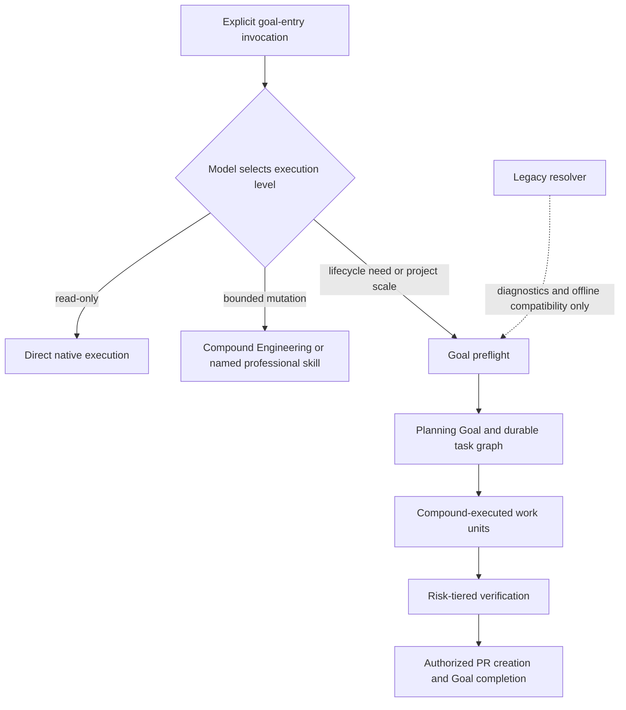
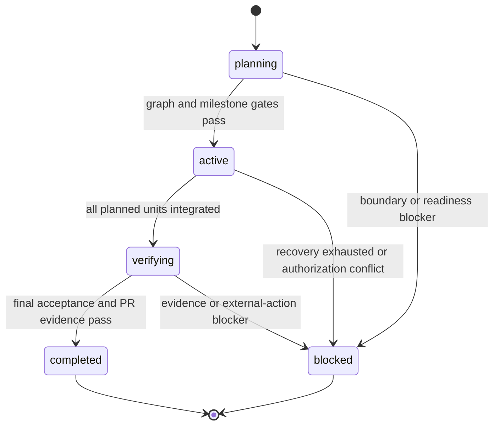
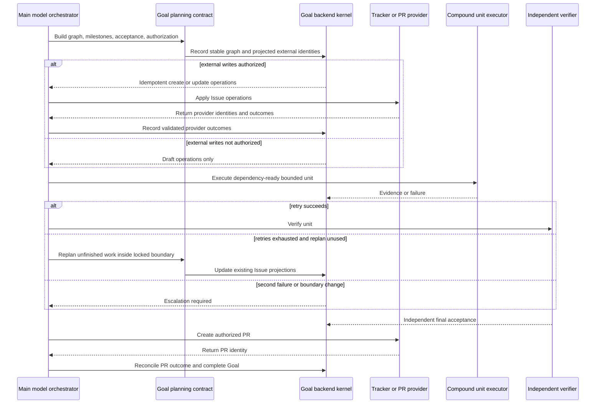

# Model-Native Goal Entry Lifecycle - Plan

## Goal Capsule

- **Objective:** Make `goal-entry` a thin, explicitly invoked task entry that lets the model choose direct read-only work, Compound Engineering, or a durable Goal while a deterministic lifecycle spine protects authorization, state, evidence, recovery, Issue projection, acceptance, and PR completion.
- **Authority hierarchy:** The user's original request and confirmed Product Contract outrank the plan; the model owns semantic judgment inside that boundary; deterministic Goal contracts may narrow execution but may not invent scope.
- **Execution profile:** Model-native routing, Goal-owned lifecycle, Compound-owned bounded engineering units, main-orchestrator-only Goal operations, and risk-tiered independent acceptance.
- **Stop conditions:** Stop and ask when the objective or authorized scope changes, an external action lacks authorization, an operation is irreversible or high-risk, or evidence is insufficient for a completion claim. Normal retries, within-scope replanning, Issue synchronization, and milestone progress do not stop for confirmation.
- **Tail ownership:** A Goal reaches completion when an authorized PR exists and the plan's pre-PR verification and acceptance gates pass. PR merge and continuing review follow-up remain outside this Goal unless the original request includes them.

---

## Product Contract

### Summary

Refactor `goal-entry` into a model-native execution-level selector backed by a small deterministic Goal lifecycle toolchain.
Complex modifications should move from a planning Goal through task graph, milestone, Issue, Compound execution, acceptance, and PR creation without introducing a second project manager or central skill dispatcher.

### Problem Frame

The public `goal-entry` skill is short, but normal runtime still delegates semantic authority to a 921-line regex resolver that also owns phase compilation, runtime profiles, cursor selection, idempotency, provider attestation, and two-pass session output.
That arrangement makes the apparent router light while keeping the effective control plane heavy and duplicates judgment already available from the model and Compound Engineering.

The co-located Goal family already provides a safer foundation: preflight, context, objective, planning, dispatch, a six-capability backend, nine expert classes, trace validation, cleanup, and closeout.
The missing product seam is a durable project flow that turns model judgment into a constrained Goal session, preserves the original authorization boundary, synchronizes task graphs with Issues, executes bounded work through Compound capabilities, and prevents completion without evidence.

### Actors

- A1. **Goal Owner:** Invokes `goal-entry`, defines the desired outcome and external-action authorization, and resolves boundary changes.
- A2. **Main Model Orchestrator:** Selects the execution level, decomposes Goal work, chooses professional skills, controls Goal tools, and integrates results.
- A3. **Compound Executor or Goal Expert:** Performs one bounded engineering or domain unit with only the skills allowed for that unit.
- A4. **Independent Verifier:** Did not execute the governed change and evaluates evidence against locked acceptance criteria.
- A5. **Tracker and PR Provider:** Applies authorized Issue and PR operations while the Goal backend records provider-neutral identity and evidence.

### Requirements

**Entry and semantic routing**

- R1. `goal-entry` participates only when the user explicitly invokes it; it is not an implicit wrapper around every task.
- R2. Once invoked, the model selects exactly one execution level: direct/native, Compound Engineering, or Goal lifecycle.
- R3. Direct/native execution is limited to read-only work; any artifact-changing engineering request must use Compound Engineering or Goal lifecycle.
- R4. The model may upgrade a request to Goal lifecycle without the user saying “Goal” when lifecycle needs or task scale make one bounded execution unreliable.
- R5. Lifecycle need includes cross-turn resume, durable state, multi-stage acceptance, monitoring, or repeated iteration; task scale includes cross-module work, dependent stages, or a project-shaped outcome.
- R6. A user-named professional skill remains the preferred execution capability inside the selected level; `goal-entry` does not maintain a central semantic skill map.
- R7. Short replies inherit the current task, execution level, and named skill rather than being reclassified as standalone requests.
- R8. Explicit no-execution wording is a hard veto, and unresolved uncertainty begins with read-only inspection before any confirmation or mutation.

**Goal planning and external projections**

- R9. A Goal route runs preflight and then creates or resumes a `planning` Goal automatically when the gate passes, informing the user without a separate confirmation.
- R10. Goal lifecycle follows `planning → active → verifying → completed`, with `blocked` available from any non-terminal state when the escalation contract is satisfied.
- R11. Planning produces a durable task graph containing milestones, dependencies, acceptance criteria, and stable work-unit identities before execution becomes active.
- R12. Each milestone maps to one primary Issue; only independently deliverable, independently accepted, or blocking units become child Issues.
- R13. Issue and PR writes occur automatically only when the original request authorizes those external actions; otherwise the system produces drafts without external mutation.
- R14. Within the original objective and authorization scope, replanning updates existing Issue content, dependencies, milestone, and status rather than creating duplicate Issues.
- R15. Goal, work-unit, milestone, Issue, and PR identities remain idempotent across retries and cross-turn resume.

**Execution, experts, and recovery**

- R16. Goal owns lifecycle, dependencies, acceptance, and completion; Compound Engineering or another user-named professional skill executes each bounded engineering unit.
- R17. The model owns task decomposition, plan content, professional skill selection, within-scope plan adjustment, and user-facing Issue, acceptance, and PR copy.
- R18. The deterministic toolchain owns state transitions, authorization scope, task-graph identity, Issue mapping, retry and replan budgets, evidence, trace, cleanup, Goal synchronization, and completion gates.
- R19. Goal tools and backend mutation remain main-orchestrator-only; experts cannot call Goal tools, `goal-*`, the backend directly, or reserved orchestration pipelines.
- R20. Experts may call only registered professional skills allowed by their capability families, with the global deny taking precedence and every allow or deny recorded.
- R21. A failing work unit receives bounded corrective retries and then at most one automatic replan of unfinished work; another failure asks the Goal Owner for direction.
- R22. Routine retries, dependency-safe scheduling, milestone updates, and within-scope replanning proceed automatically; only boundary changes, unauthorized external effects, irreversible high-risk actions, or evidence-insufficient completion claims require confirmation.

**Acceptance, PR, and compatibility**

- R23. Every milestone receives mechanical validation; high-risk units additionally require independent acceptance, and the final PR claim always requires an independent verifier.
- R24. The Goal enters `verifying` only after all planned work is integrated, required runtime handles are reconciled, and unit-level evidence is complete.
- R25. The Goal may enter `completed` only after required pre-PR checks pass, independent final acceptance passes, and an authorized PR identity is recorded; PR merge is not required.
- R26. The legacy resolver remains available only for compatibility, diagnostics, and offline regression testing and is no longer the normal runtime semantic authority.
- R27. Existing Goal Session, cursor, legacy trace, installer, and package-validation contracts remain readable during migration; incompatible old input fails closed rather than being silently upgraded.
- R28. Release validation covers source and temporary installed surfaces and proves that no resume creates a duplicate Goal, Issue, or PR.

### Key Flows

- F1. **Direct or Compound execution**
  - **Trigger:** A1 explicitly invokes `goal-entry` for a bounded request.
  - **Actors:** A1, A2
  - **Steps:** A2 interprets the full conversational context; read-only work stays direct; artifact-changing work routes to Compound; a named skill is retained.
  - **Outcome:** The task starts without Goal state or lifecycle overhead.
  - **Covered by:** R1-R8.

- F2. **Planning Goal and Issue publication**
  - **Trigger:** A2 detects lifecycle need or project scale, or A1 explicitly requests a Goal.
  - **Actors:** A1, A2, A5
  - **Steps:** Preflight validates the model route and original authorization; the Goal starts in planning; A2 builds the graph and milestones; authorized Issues are created or drafts are prepared; the lifecycle advances to active when the execution gate passes.
  - **Outcome:** A durable project graph and stable external projection exist before implementation.
  - **Covered by:** R9-R15.

- F3. **Bounded execution and recovery**
  - **Trigger:** An active work unit has satisfied dependencies.
  - **Actors:** A2, A3, A4
  - **Steps:** A2 selects the minimum expert and preferred professional skill; A3 executes; validation records evidence; failure retries within budget, then replans unfinished work once and synchronizes existing Issues.
  - **Outcome:** The unit is accepted, safely replanned, or escalated without expanding authorization.
  - **Covered by:** R16-R22.

- F4. **Final verification and PR completion**
  - **Trigger:** All active work units are integrated.
  - **Actors:** A2, A4, A5
  - **Steps:** The Goal enters verifying; cleanup and trace gates run; A4 independently accepts the final claim; A5 creates the authorized PR; the PR identity is recorded before completion.
  - **Outcome:** The Goal completes at an open, evidence-backed PR without claiming merge.
  - **Covered by:** R23-R25.

- F5. **Cross-turn resume and idempotent synchronization**
  - **Trigger:** A1 resumes a prior task or repeats a previous request after interruption.
  - **Actors:** A1, A2, A5
  - **Steps:** A2 uses the verified cursor and durable Goal artifacts; the toolchain replays completed operations, reconciles existing Issues and PR identity, and continues from the first incomplete gate.
  - **Outcome:** Work resumes without duplicate Goal, Issue, or PR creation.
  - **Covered by:** R7, R14-R15, R26-R28.

### Acceptance Examples

- AE1. **Covers R2-R4.** Given an explicitly invoked read-only repository question, when the model routes it, then it stays direct and creates no Goal state.
- AE2. **Covers R3, R6.** Given a bounded mutation request naming `ce-debug`, when the model routes it, then it uses Compound Engineering with `ce-debug` preferred and creates no Goal.
- AE3. **Covers R4-R5, R9.** Given a cross-module project with dependent acceptance stages but no literal “Goal” wording, when preflight passes, then a planning Goal is created automatically.
- AE4. **Covers R7.** Given the current task selected Goal plus a named professional skill, when the user replies “1” or “继续”, then the route and skill remain inherited.
- AE5. **Covers R11-R14.** Given authorized Issue publication and a within-scope replan, when the task graph changes, then existing Issue identities are updated and no duplicate child Issue is created.
- AE6. **Covers R13, R22.** Given a project request that did not authorize external writes, when planning finishes, then Issue and PR drafts are produced but no provider mutation occurs.
- AE7. **Covers R19-R20.** Given an expert requests a Goal tool or reserved orchestration skill, when authorization runs, then the call is denied and recorded even if another family contains a similar skill.
- AE8. **Covers R21-R22.** Given a unit exhausts corrective retries, when one within-scope replan also fails, then the Goal asks A1 instead of replanning indefinitely or claiming completion.
- AE9. **Covers R23-R25.** Given all work is integrated but the final verifier is the implementer, when completion is attempted, then the Goal remains verifying and no completion claim is recorded.
- AE10. **Covers R15, R28.** Given a completed Issue creation or PR creation operation is replayed with the same idempotency identity, when resume runs, then the existing external identity is returned without another create call.

### Success Criteria

- The normal public route no longer calls the legacy semantic resolver.
- A representative complex project reaches `completed` through planning, active execution, verification, authorized PR creation, and independent final acceptance.
- Direct and Compound routes allocate no Goal artifacts.
- Within-scope replanning updates existing Issue projections and preserves accepted milestone evidence.
- Repeated execution and resume fixtures create no duplicate Goal, Issue, or PR identities.
- Package, installer, legacy compatibility, backend authorization, lifecycle, and full unittest gates pass together.

### Scope Boundaries

#### In scope

- Model-native execution-level routing with direct, Compound, and Goal levels.
- One Goal lifecycle spanning task graph, milestones, authorized Issue projection, bounded recovery, risk-tiered acceptance, PR creation, resume, trace, and cleanup.
- Existing nine-expert backend with controlled professional skill families, including frontend/UI capability.
- Legacy resolver and trace compatibility as non-authoritative migration surfaces.

#### Deferred for later

- Multi-Goal coordination and portfolio-level dependency management.
- Automatic skill discovery or automatic permission grants for newly installed skills.
- PR merge, continuous review follow-up, and post-merge deployment ownership.
- A visual dashboard for Goal graph, Issues, experts, evidence, and lifecycle state.

#### Outside this product's identity

- Implicitly wrapping every user request in `goal-entry`.
- A central skill registry that decides semantic routing for the model.
- Turning `goal-backend` into a second planner, provider selector, or public entry.
- Allowing experts or subagents to own Goal tools, widen authorization, self-accept high-risk work, or retry without bound.

### Dependencies and Assumptions

- The host model can make the semantic execution-level decision from the active conversation; deterministic code validates the decision envelope but does not reproduce the judgment with regex classification.
- The host exposes the professional skills, tracker/PR capability, and Goal tools needed by the selected route; unavailable capability is surfaced rather than silently substituted.
- Original authorization can be normalized into a stable scope and explicit external-action grants that survive resume.
- Provider-specific Issue and PR calls stay outside the backend kernel; the kernel records stable projection identity, requested operation, authorization, and result evidence.
- The current six backend capability identifiers and nine expert classes remain stable; new mechanics fit behind those capability boundaries.
- The two existing runtime profiles remain compatible, while the generic lifecycle state machine becomes their shared project spine.

---

## Planning Contract

**Product Contract preservation:** The confirmed brainstorm scope is reproduced without substantive change. Planning adds implementation boundaries, compatibility posture, and verification detail only.

### Key Technical Decisions

- KTD1. **Model judgment is the semantic authority.** `goal-entry` instructions define the three execution levels and require a compact route decision; deterministic code validates shape, mutation boundaries, context inheritance, and authorization but does not choose the route.
- KTD2. **The legacy resolver becomes an explicit compatibility adapter.** Existing CLI and fixtures remain valid for offline consumers, while the public skill and new preflight path do not call it during normal execution.
- KTD3. **Preflight materializes the trusted Goal Session.** A validated model route, objective, verified resume cursor, original authorization, and idempotency identity become the session fingerprint consumed by backend authorization.
- KTD4. **The backend remains a six-capability kernel.** Lifecycle transitions, recovery budgets, Issue projection, and completion evidence are implemented behind existing capability names rather than widening the public backend vocabulary.
- KTD5. **Goal state is explicit and monotonic.** New runs begin in planning; only contract-checked transitions advance them; terminal completed or blocked states cannot be reopened by replay.
- KTD6. **External systems are provider-neutral projections.** The backend computes and records idempotent Issue/PR operations, while the main orchestrator uses the available provider tool only when the original authorization permits it.
- KTD7. **Compound skills execute units, not the Goal.** Goal dispatch chooses a bounded professional capability and expert; recursive project-level orchestrators remain globally denied to experts.
- KTD8. **Recovery is bounded and evidence-preserving.** Profile retry limits remain in force, only one unfinished-work replan is allowed, accepted milestones are immutable, and boundary changes escalate.
- KTD9. **Completion is a PR evidence gate.** Final acceptance, cleanup, integration, and required pre-PR checks precede PR creation; the recorded PR identity permits completion, while merge and post-PR babysitting remain separate.
- KTD10. **Release is a major public-contract transition.** The package version advances to `2.0.0`, with migration notes explaining that the resolver remains available but is no longer the runtime router.
- KTD11. **Semantic choice and mechanical authority are separate, one-way layers.** The model route is the sole semantic execution-level decision; preflight validates and binds that record but never reclassifies it. Backend capability gates independently distinguish planning mutation, bounded-unit execution, verification, and closeout authority.
- KTD12. **The atomic manifest remains authoritative state; the event ledger is its recovery journal.** Preserve the existing lightweight storage boundary: lifecycle, task-graph, projection, and completion state advances through atomic manifest compare-and-set updates, while append-only intent/outcome events make external operations auditable and recoverable. Trace validation rejects manifest/event divergence instead of introducing a general event-sourcing subsystem.
- KTD13. **External writes use intent, reconciliation, and outcome records.** Before an Issue or PR provider call, the kernel records an operation identity and desired-state digest; after the call it records the provider identity and result. Resume reconciles an uncertain intent against the provider before retrying and never blindly creates after an ambiguous outcome.
- KTD14. **Provider boundaries are untrusted and credential-free inside Goal artifacts.** Only the main orchestrator calls provider tools; backend records accept schema-validated identities and digests bound to the authorized operation, never credentials or arbitrary provider payloads. Completion re-reads or reconciles the PR identity through the provider adapter before trusting it.

### High-Level Technical Design

#### Execution-level ownership

#### Goal lifecycle

#### Existing capability ownership

| Lifecycle responsibility | Existing backend capability | Authorized owner |
| --- | --- | --- |
| Create or resume the planning run and bind its immutable scope | `run.initialize` | `goal-context` |
| Record the validated graph, Issue operation intents/outcomes, unit evidence, and recovery events | `evidence.record` | `goal-dispatch` for planning/projection; `goal-team` for expert evidence |
| Prove planning-to-active and active-to-verifying prerequisites | `trace.validate` | `goal-trace` |
| Reconcile owned runtime handles before final acceptance | `runtime.cleanup` | `goal-close` |
| Record PR intent/outcome, synchronize Goal tools, and commit verifying-to-completed | `goal.sync` | `goal-close` |
| Read historical traces without mutating them | `trace.read_legacy` | `goal-trace` |

`goal-plan` produces the model-authored graph but does not mutate backend state directly; `goal-dispatch` validates and records that graph through `evidence.record`. Transition code selects the capability above from the requested transition and rejects an owner/capability mismatch.

#### Planning, replanning, and external projection

### Assumptions

- Model-route quality is protected through explicit behavioral fixtures, route-envelope validation, no-execution precedence, and mutation gates; unit tests cannot prove general natural-language judgment.
- Existing provider tools expose or return stable Issue and PR identifiers suitable for idempotency records.
- Provider adapters can query or search by a stable operation marker when a process crashes after the provider succeeds but before the local outcome is recorded. If that capability is unavailable, the operation blocks for owner reconciliation instead of retrying a create.
- A planning Goal may be created before an execution provider is selected; backend authorization therefore distinguishes planning mutations from unit execution authority.
- The modified ideation document and the existing harness-removal plan are user-owned inputs. Implementation must preserve their useful historical content, update contradictions only when required by the new public contract, and avoid silently discarding them.

### System-Wide Impact

- **Public skill behavior:** `goal-entry` changes from explicit durable-Goal-only routing to an explicitly invoked general entry with automatic Goal upgrade.
- **Backend authorization:** Authorization becomes capability-aware so planning, execution, validation, and closeout require the appropriate authority instead of one uniform provider gate.
- **Artifacts:** New Goal runs gain lifecycle, authorization-scope, task-graph, external-projection, recovery, and PR evidence while legacy traces remain read-only.
- **Expert execution:** Professional skill use remains explicit and auditable; Compound orchestration is available to the main Goal flow without being delegated recursively to experts.
- **Installation:** The source and installed Goal family must be validated as one package after the public contract and backend schemas change.

### Risks and Dependencies

- **Semantic drift:** A model may choose inconsistent levels across turns. Mitigate with context inheritance, a compact route record, and a hard direct-write veto.
- **Compatibility ambiguity:** Old consumers may treat resolver output as authoritative. Mitigate with stable CLI behavior, deprecation wording, legacy regression tests, and a major-version migration note.
- **Projection divergence:** Tracker state may change independently of the Goal graph. Mitigate with stable mapping keys, current-state reconciliation, provider result evidence, and update-over-create behavior.
- **Crash-window duplication:** A provider may apply an Issue or PR write before the local outcome is durable. Mitigate with write-ahead intent events, stable operation markers, provider reconciliation, outcome events, and a fail-closed rule for ambiguous creates.
- **Split authority:** Route validation could silently become a second semantic classifier. Mitigate by accepting only the model's compact route record, rejecting invalid envelopes, and prohibiting preflight or backend code from changing the selected level.
- **Projection corruption:** Updating manifest and external mappings as independent writable stores could create impossible lifecycle states. Mitigate with atomic manifest compare-and-set updates, write-ahead intent/outcome events, prior-state and scope digests, and trace checks that reject manifest/event divergence.
- **Provider spoofing or leakage:** A malformed provider response could inject arbitrary data or a fake PR identity into completion evidence, while serialized credentials would leak into durable artifacts. Mitigate with main-only provider calls, schema-validated identifiers, operation-digest binding, reconciliation reads, and a contract forbidding credentials or raw provider payloads in Goal state.
- **Recursive orchestration:** Allowing Compound skills inside Goal could re-enter project-level pipelines. Mitigate by keeping project orchestrators globally denied to experts and letting only the main orchestrator select bounded skills.
- **False completion:** A PR identity alone could mask weak evidence. Mitigate by making lifecycle transition validation require cleanup, integration, mechanical gates, and independent final acceptance before PR-backed completion.
- **Dirty-tree collision:** Existing user docs overlap the product area. Preserve them, inspect every overlapping hunk, and keep unrelated residue outside implementation changes.

### Sources and Research

- `SKILL.md`, `README.md`, and `references/architecture.md` establish the current explicit-Goal-only public boundary.
- `scripts/resolve_goal_entry.py` shows the current combined semantic, lifecycle, cursor, idempotency, and provider control plane.
- `skills/goal-preflight/scripts/run_goal_preflight.py` shows normal preflight currently imports the installed legacy resolver.
- `skills/goal-backend/scripts/goal_backend_common.py` and `skills/goal-backend/references/backend-map.md` define the six-capability authorization kernel.
- `scripts/validate_goal_runtime.py` and `references/runtime_profiles.json` provide existing bounded retry, replan, milestone, verifier, cleanup, and profile patterns.
- `skills/goal-backend/references/expert-registry.json` and `skills/goal-backend/references/skill-family-registry.json` define the nine experts and controlled professional skill families.
- `docs/ideation/2026-07-10-goal-entry-complex-engineering-autoresearch-ideation.html` records the control-plane and runtime-kernel direction already present in the working tree.
- `docs/plans/2026-07-13-001-refactor-goal-backend-harness-removal-plan.md` records the completed architectural cut from harness identity to the co-located Goal backend family.

---

## Implementation Units

### U1. Replace runtime regex routing with a model-route contract

- **Goal:** Make the public skill and normal execution path model-native while retaining a small machine-checkable route envelope.
- **Requirements:** R1-R8, R26.
- **Dependencies:** None.
- **Files:** `SKILL.md`; `agents/openai.yaml`; `README.md`; `references/architecture.md`; `references/model_route_contract.json`; `scripts/validate_model_route.py`; `scripts/quick_validate.py`; `tests/fixtures/model_route_cases.json`; `tests/test_model_route_contract.py`; `tests/test_package_contract.py`.
- **Approach:** Define direct, Compound, and Goal as execution levels selected by the model from full context. Validate that direct is read-only, no-execution wins, short replies may inherit a prior route, and named professional skills are preserved. Remove the public instruction to execute the legacy resolver and label that resolver as diagnostic compatibility.
- **Execution note:** Add contract fixtures first so the public wording and validator are constrained before changing route documentation.
- **Patterns to follow:** Existing JSON contract loading in `references/entry_session_contract.json`; fail-closed fixture validation in `scripts/quick_validate.py`; router-only language in `AGENTS.md`.
- **Test scenarios:**
  1. A read-only decision validates as direct and contains no Goal action.
  2. A mutating decision labeled direct fails with a direct-write violation.
  3. A bounded mutation validates as Compound and retains a user-named skill.
  4. A project-scale decision validates as Goal without requiring a literal Goal token in the request.
  5. A numeric or continuation reply validates only when it carries inherited route context.
  6. An explicit no-execution decision cannot carry a mutating execution level.
  7. Public skill validation fails if normal runtime again instructs callers to run `resolve_goal_entry.py`.
- **Verification:** The model-route fixture suite passes; the public skill stays short and contains no central skill map or semantic regex rules; the legacy resolver CLI remains callable only as a documented compatibility surface.

### U2. Build Goal Sessions from model routes in preflight

- **Goal:** Turn a validated Goal route into a trusted, idempotent Goal Session without invoking the legacy resolver.
- **Requirements:** R9-R10, R13, R15, R18-R19, R26-R28.
- **Dependencies:** U1.
- **Files:** `references/entry_session_contract.json`; `skills/goal-preflight/SKILL.md`; `skills/goal-preflight/references/preflight-contract.md`; `skills/goal-preflight/scripts/run_goal_preflight.py`; `skills/goal-backend/scripts/goal_backend_common.py`; `tests/fixtures/model_route_cases.json`; `tests/fixtures/cursor_cases.json`; `tests/test_entry_session_contract.py`; `tests/test_backend_authorization.py`; `tests/test_goal_preflight.py`.
- **Approach:** Add a model-route input to preflight, derive the request fingerprint and session identity from the authoritative instruction, route, objective, cursor, and authorization scope, and return the entry decision used by backend authorization. Keep an explicit legacy fallback for diagnostic callers. Make backend authority capability-aware so planning initialization does not pretend unit execution has already been authorized.
- **Execution note:** Characterize existing resolver-backed preflight and backend authorization before replacing the normal dependency.
- **Patterns to follow:** Atomic fingerprinting and cursor checks in `scripts/resolve_goal_entry.py`; current preflight blockers; session and preflight binding checks in `goal_backend_common.py`.
- **Test scenarios:**
  1. A valid create route with passed readiness produces a planning Goal Session and stable fingerprint.
  2. A valid resume route requires a verified cursor and rejects stale, missing-source, or caller-issued cursors.
  3. Replaying the same idempotency identity returns the same session; changing the fingerprint conflicts.
  4. An objective over 4,000 characters blocks Goal mutation.
  5. A planning capability is authorized with planning authority, while expert execution remains denied until execution authority exists.
  6. A direct or Compound route cannot initialize Goal artifacts.
  7. The explicit legacy fallback reproduces the supported compatibility envelope without becoming the default path.
- **Verification:** Preflight imports no installed resolver on the model-route path; backend authorization accepts only matching route, session, preflight, Goal, and scope bindings.

### U3. Add the planning lifecycle, task graph, and Issue projection kernel

- **Goal:** Persist the project graph and enforce planning-to-active progression with authorized, idempotent Issue synchronization.
- **Requirements:** R10-R15, R18, R22.
- **Dependencies:** U2.
- **Files:** `skills/goal-plan/SKILL.md`; `skills/goal-plan/references/plan-builder.md`; `skills/goal-backend/references/artifact-contract.md`; `skills/goal-backend/references/backend-map.md`; `skills/goal-backend/references/lifecycle-contract.json`; `skills/goal-backend/references/schemas/goal-manifest.schema.json`; `skills/goal-backend/references/schemas/goal-event.schema.json`; `skills/goal-backend/scripts/init_goal_run.py`; `skills/goal-backend/scripts/advance_goal_lifecycle.py`; `skills/goal-backend/scripts/sync_issue_projection.py`; `skills/goal-backend/scripts/validate_goal_trace.py`; `tests/test_backend_capabilities.py`; `tests/test_goal_lifecycle.py`; `tests/test_issue_projection.py`.
- **Approach:** Initialize new runs in planning with an immutable authorization-scope digest. Preserve the atomic manifest as authoritative state and use append-only events as the write-ahead recovery and audit journal for stable graph, milestone, work-unit, and Issue-projection identities. Guard lifecycle changes with prior-state and scope-digest checks. `goal-dispatch` records the validated `goal-plan` graph through `evidence.record`; `goal-trace` validates progression through `trace.validate`. Advance to active only when dependencies and acceptance criteria are complete and Issue operations are either applied under authorization or explicitly retained as drafts. Record write-ahead provider intent, reconcile uncertain outcomes, then record only schema-validated provider identity bound to the operation digest; reconciliation updates mapped Issues and forbids duplicate create operations.
- **Execution note:** Start with failing lifecycle-transition and replay tests; keep the event ledger append-only and derived state reproducible.
- **Patterns to follow:** Atomic manifest writes and append-only events in the backend; dependency and accepted-evidence checks in `scripts/validate_goal_runtime.py`.
- **Test scenarios:**
  1. A new run begins in planning and cannot skip directly to verifying or completed.
  2. Planning cannot advance without a graph, milestones, acceptance criteria, and stable identities.
  3. An authorized milestone produces one primary Issue operation and only qualifying child units produce child Issue operations.
  4. An unauthorized external action produces a draft and no provider-applied state.
  5. A within-scope replan updates existing Issue mappings and preserves accepted milestones.
  6. A scope-digest change blocks automatic Issue synchronization and requests owner direction.
  7. Replaying a completed Issue operation returns its recorded provider identity without another create operation.
  8. A crash after provider success but before local outcome recording is reconciled by operation identity and does not create a second Issue.
  9. Trace validation detects manifest/event divergence, recovery completes a pending intent without rebuilding unrelated state, and a stale prior-state digest cannot advance lifecycle.
  10. A malformed provider result, mismatched operation digest, credential-like field, or raw provider payload is rejected before it reaches durable Goal state.
- **Verification:** Lifecycle replay and Issue projection tests prove monotonic atomic state, manifest/event consistency, capability ownership, authorization enforcement, provider-result validation, update-over-create behavior, crash-window reconciliation, and no duplicate external identity.

### U4. Route bounded units through Compound skills with bounded recovery

- **Goal:** Let Goal execution use model-selected professional capabilities without giving experts lifecycle or recursive orchestration authority.
- **Requirements:** R16-R22.
- **Dependencies:** U3.
- **Files:** `skills/goal-dispatch/SKILL.md`; `skills/goal-dispatch/references/dispatch-contract.md`; `skills/goal-team/SKILL.md`; `skills/goal-team/references/team-map.md`; `skills/goal-team/scripts/select_goal_experts.py`; `skills/goal-backend/references/expert-registry.json`; `skills/goal-backend/references/skill-family-registry.json`; `skills/goal-backend/scripts/authorize_expert_skill.py`; `skills/goal-backend/scripts/record_recovery_action.py`; `references/runtime_profiles.json`; `scripts/validate_goal_runtime.py`; `tests/test_expert_authorization.py`; `tests/test_minimum_team_policy.py`; `tests/test_goal_runtime_replay.py`; `tests/test_goal_recovery.py`.
- **Approach:** Keep one primary expert by default, add specialists only for real domain boundaries, prefer the user-named skill when its family permits it, and record provider-neutral dispatch evidence. Reuse profile retry limits, permit one boundary-preserving replan, and block further automatic recovery. Keep Goal and project-level Compound orchestrators under the hard deny for experts while allowing reviewed bounded Compound skills.
- **Execution note:** Preserve current allow/deny characterization before changing any family membership or recovery events.
- **Patterns to follow:** Table-driven expert registry and global deny; current independent-verifier selection; bounded retry and `replan_unfinished` validation.
- **Test scenarios:**
  1. A user-named allowed professional skill is selected for the matching expert family.
  2. An unknown or family-mismatched skill is denied and recorded.
  3. Goal tools, `goal-*`, backend, LFG, `ce-work`, and release orchestration remain denied to experts.
  4. A failed unit retries only within its profile budget.
  5. Retry exhaustion permits one replan that preserves authorization and accepted evidence.
  6. A second replan or a boundary-changing replan blocks and requires owner direction.
  7. An unrelated dependency-safe unit may continue while a failed branch is replanned.
- **Verification:** Expert authorization, minimum-team, runtime replay, and recovery suites pass with every decision trace-visible.

### U5. Enforce verifying, independent acceptance, and PR-backed completion

- **Goal:** Prevent Goal completion until integration, cleanup, verification, final independence, and authorized PR evidence all pass.
- **Requirements:** R23-R25, R28.
- **Dependencies:** U3, U4.
- **Files:** `skills/goal-trace/SKILL.md`; `skills/goal-trace/references/trace-map.md`; `skills/goal-close/SKILL.md`; `skills/goal-close/references/closeout-contract.md`; `skills/goal-backend/scripts/check_independent_acceptance.py`; `skills/goal-backend/scripts/advance_goal_lifecycle.py`; `skills/goal-backend/scripts/finalize_goal_sync.py`; `skills/goal-backend/scripts/validate_goal_trace.py`; `tests/test_independent_acceptance.py`; `tests/test_cleanup_and_sync.py`; `tests/test_goal_lifecycle.py`; `tests/test_pr_completion_gate.py`.
- **Approach:** Move active runs to verifying only after all planned units are integrated and runtime ownership is reconciled. Require mechanical evidence for every milestone, independent acceptance for high-risk units and the final PR claim, and an authorized idempotent PR identity before completed. Apply the same write-ahead intent, schema-validated provider result, reconciliation read, and outcome protocol to PR creation. Commit verifying-to-completed only through `goal.sync` owned by `goal-close`; keep Goal-tool synchronization ordered and main-only.
- **Execution note:** Add failing completion-gate tests before widening closeout behavior.
- **Patterns to follow:** Current governed-claim acceptance checks, cleanup reconciliation, trace validation, and pre/post Goal synchronization records.
- **Test scenarios:**
  1. Active cannot enter verifying while a planned unit, cleanup handle, or required evidence is unresolved.
  2. A high-risk unit cannot pass with a self-verifier; a low-risk read-only unit may use its permitted lighter check.
  3. Final acceptance always rejects the implementing instance as verifier.
  4. PR creation without original authorization is represented as a draft and cannot complete the Goal.
  5. A recorded PR identity without passing verification cannot complete the Goal.
  6. A fully accepted and authorized PR operation advances verifying to completed exactly once.
  7. PR merge status and post-PR review activity do not alter completed Goal state.
  8. A crash after PR creation but before local outcome recording reconciles the existing PR and completes exactly once; an unreconcilable intent remains verifying.
  9. A forged, malformed, operation-mismatched, or unreconciled PR identity cannot satisfy the completion gate.
- **Verification:** Trace and lifecycle validators reject every false-completion fixture and accept the complete reference project flow.

### U6. Preserve compatibility and ship the unified package contract

- **Goal:** Release the new public behavior without losing legacy diagnostics, package integrity, or installability.
- **Requirements:** R26-R28 and all success criteria.
- **Dependencies:** U1-U5.
- **Files:** `scripts/resolve_goal_entry.py`; `scripts/quick_validate.py`; `scripts/check_goal_stack.py`; `scripts/install_goal_stack.py`; `goal-stack-manifest.json`; `skills/goal-metadata/SKILL.md`; `skills/goal-metadata/references/metadata-refresh.md`; `VERSION`; `CHANGELOG.md`; `README.md`; `docs/ideation/2026-07-10-goal-entry-complex-engineering-autoresearch-ideation.html`; `docs/plans/2026-07-13-001-refactor-goal-backend-harness-removal-plan.md`; `tests/test_installed_surface.py`; `tests/test_installer_transaction.py`; `tests/test_legacy_trace_compatibility.py`; `tests/test_package_contract.py`; `tests/test_resolve_goal_entry.py`.
- **Approach:** Keep the resolver CLI and legacy tests stable while marking them non-authoritative. Refresh validation markers and metadata for the model-route and lifecycle contracts, reconcile the existing related docs with the new public identity, bump the major version, and validate a temporary installed tree without mutating the live skill root.
- **Execution note:** Treat current dirty documentation as user-owned; merge intentionally and verify the diff before release.
- **Patterns to follow:** Transactional installer tests, manifest-owned installed-surface checks, current legacy trace reader, and version/changelog release convention.
- **Test scenarios:**
  1. Legacy resolver fixtures and CLI projections still pass as diagnostic compatibility.
  2. Source validation requires the model-route, lifecycle, recovery, Issue, and PR completion contracts.
  3. A temporary clean install matches the source Goal family and contains no removed harness skill.
  4. Installer rollback restores the prior temporary surface on a simulated failure.
  5. Public docs consistently describe explicit invocation, model-native levels, automatic Goal upgrade, Compound unit execution, and PR completion.
  6. No package file introduces local absolute paths or an unreviewed skill permission.
- **Verification:** The full release matrix passes on source and temporary installed surfaces; the diff contains no abandoned migration code or contradictory public instructions.

---

## Verification Contract

| Gate | Command or evidence | Proves |
| --- | --- | --- |
| Model-route and package validation | `python3 scripts/quick_validate.py .` | Public contract, route fixtures, backend contracts, and full nested unit suite agree. |
| Goal stack structure | `python3 scripts/check_goal_stack.py .` | Public router, ten private skills, registries, hard denies, and JSON contracts are internally consistent. |
| Legacy resolver compatibility | `python3 scripts/resolve_goal_entry.py --request 'PLEASE IMPLEMENT THIS PLAN with tests' --readiness-status passed` | Diagnostic CLI remains readable while ordinary output stays free of Goal-only state. |
| Runtime profile compatibility | `python3 scripts/validate_goal_runtime.py tests/fixtures/engineering_runtime_trace.json tests/fixtures/autoresearch_runtime_trace.json` | Existing engineering and research traces retain bounded retry, acceptance, and cleanup semantics. |
| Full unit suite | `python3 -m unittest discover -s tests -p 'test_*.py'` | Route, preflight, authorization, lifecycle, projection, recovery, acceptance, installer, and legacy regressions pass together. |
| Installed-surface rehearsal | Transactional installer tests plus `scripts/check_goal_stack.py --installed-root` against a temporary root | Source and install contracts match without touching the live local skill root. |
| Crash/replay integrity | Lifecycle and projection tests verify atomic manifest/event consistency and simulate provider-success/local-outcome-loss for Issue and PR writes | Durable state remains coherent and resume cannot duplicate external artifacts. |
| Diff quality | Repository diff check and review of user-owned documentation hunks | No whitespace errors, accidental absolute paths, stale harness identity, or unrelated dirty-tree loss. |

The reference end-to-end scenario must demonstrate: explicit `goal-entry` invocation; model-selected Goal upgrade for a complex project; planning Goal creation; task graph and authorized Issue projection; active Compound unit execution; bounded retry and one replan; verifying with independent final acceptance; authorized PR identity; completed Goal; replay with no duplicate Goal, Issue, or PR.

---

## Definition of Done

### Global completion

- The public skill is model-native and no longer instructs normal callers to run the legacy resolver.
- Direct, Compound, and Goal levels enforce their mutation and lifecycle boundaries.
- New Goal runs enforce the five-state lifecycle, original authorization scope, stable graph and external identities, bounded recovery, risk-tiered acceptance, and PR-backed completion.
- Goal experts use only registered professional skill families; Goal tools and project-level orchestration remain main-only.
- Legacy resolver, cursor, trace, and install compatibility remain validated and explicitly non-authoritative.
- Source, temporary install, runtime traces, full unittests, quick validation, and Goal-stack checks pass.
- `VERSION`, changelog, public docs, architecture docs, and related working-tree documents agree on the `2.0.0` contract.
- Abandoned experiments, duplicate schemas, obsolete runtime wiring, temporary artifacts, and unrelated generated residue are absent from the final diff.

### Per-unit completion

- U1 is done when model-route fixtures constrain all three execution levels and the public skill contains no normal resolver call.
- U2 is done when model routes create trusted idempotent Goal Sessions and planning authority is separated from unit execution authority.
- U3 is done when planning-to-active progression and Issue reconciliation are monotonic, authorized, and duplicate-safe.
- U4 is done when bounded Compound skill execution, expert permissions, retry limits, and one-replan escalation are mechanically verified.
- U5 is done when false completion is rejected and the complete accepted PR flow reaches completed exactly once.
- U6 is done when compatibility, package, documentation, versioning, and temporary installation gates all pass together.
